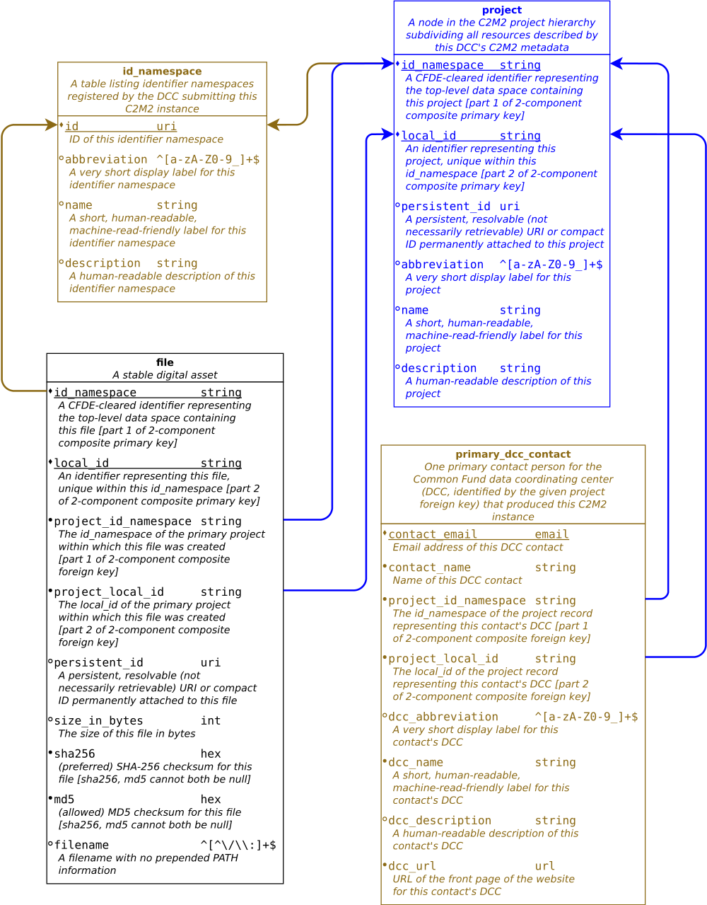
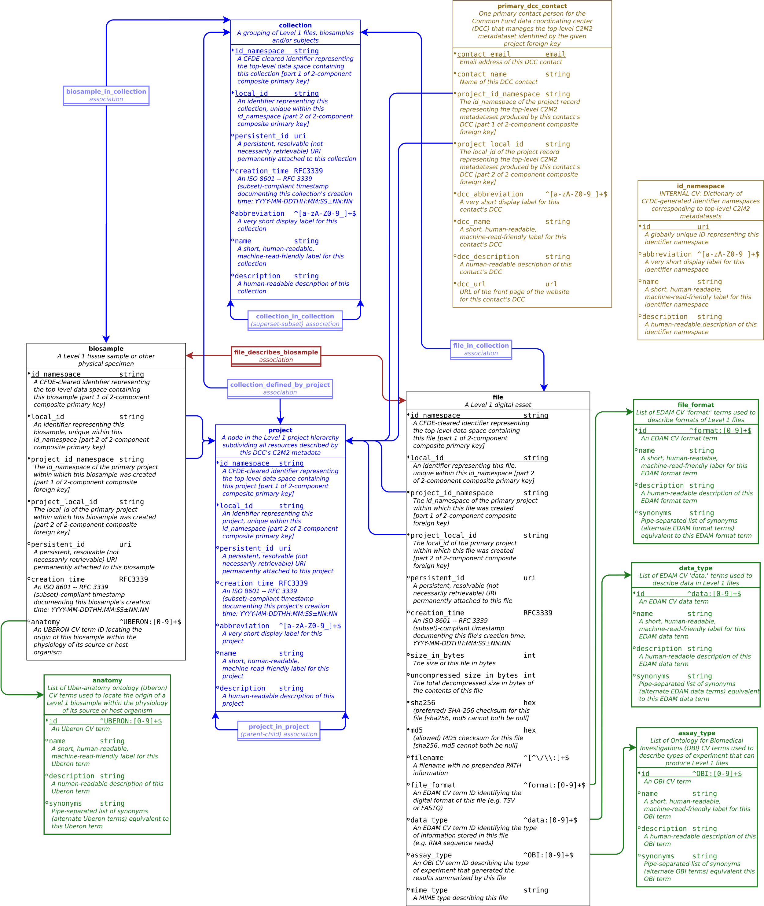
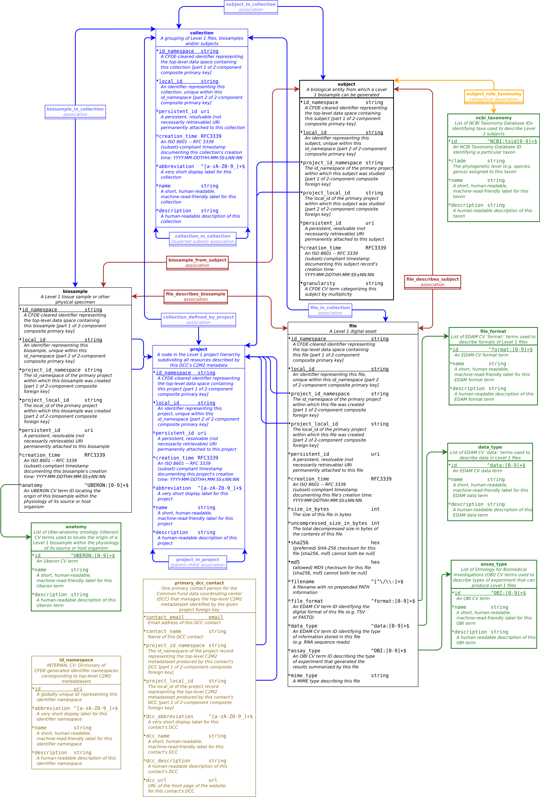

# The Common Fund Data Ecosystem's Crosscut Metadata Model (CFDE C2M2)

This document introduces the Crosscut Metadata Model
([C2M2](https://cfde-published-documentation.readthedocs-hosted.com/en/latest/CFDE-glossary/#c2m2)), a
flexible metadata standard for describing experimental resources in
biomedicine and related fields. The Common Fund Data Ecosystem
group is creating a new computing infrastructure, with C2M2 as its
organizing principle, to offer the health research community an
unprecedented array of intersectional data tools. The C2M2 system will
connect researchers with scale-powered statistical analysis
methods; deep, seamless searching across experimental data generated by
different projects and organizations; and new ways to aggregate
and integrate experimental data from different sources to
facilitate scientific replication and to drive new discoveries.

Using this new infrastructure, Common Fund data coordinating centers
([DCCs](https://cfde-published-documentation.readthedocs-hosted.com/en/latest/CFDE-glossary/#dcc)) will
share structured, detailed information ([metadata](https://cfde-published-documentation.readthedocs-hosted.com/en/latest/CFDE-glossary/#metadata))
about their experimental resources with the research
community at large, widening and deepening access to usable
observational data. One of C2M2's primary missions is to
meaningfully reduce the effort needed to perform
meta-analysis of results from multiple independent teams
studying similar health-related phenomena.

## DCC metadata submissions

DCCs collect and provide metadata submissions
(C2M2 [instances](https://cfde-published-documentation.readthedocs-hosted.com/en/latest/CFDE-glossary/#c2m2-instance))
to CFDE describing experimental resources within their purview. Each
submission is a set of tab-separated value files
([TSVs](https://cfde-published-documentation.readthedocs-hosted.com/en/latest/CFDE-glossary/#tsv));
precise formatting requirements for these filesets are specified by
JSON Schema documents, each of which is an instance of the
[Data Package](http://frictionlessdata.io/docs/data-package/)
meta-specification published by the
[Frictionless Data](http://frictionlessdata.io/)
group. The Data Package meta-specification is a toolkit for
defining format and content requirements for files so that
automatic validation can be performed on those files, just
as a database management system stores definitions for
database tables and automatically validates incoming data
based on those definitions. Using this toolkit, the C2M2 JSON
Schema specification defines
[foreign-key](https://cfde-published-documentation.readthedocs-hosted.com/en/latest/CFDE-glossary/#foreign-key)
relationships between metadata fields (TSV columns), rules
governing missing data, required content types and formats for
particular fields, and other similar database management
constraints. These architectural rules help to guarantee
the internal structural integrity of each C2M2 submission,
while also serving as a baseline standard to create
compatibility across multiple submissions received from different DCCs. During the
[C2M2 submission process](https://cfde-published-documentation.readthedocs-hosted.com/en/latest/CFDE-glossary/#c2m2-ingestion-process),
the CFDE software infrastructure uses these schematic specifications
to automatically validate format compliance and submission integrity
prior to loading C2M2 metadata into its central database. Once loaded,
C2M2 metadata will be used to fuel downstream services like web and API searching,
customized statistical summaries, dynamic display graphics, asset
browsing within experimental resource collections, and the automated
forwarding of stable, accessible experimental data files (inventoried
and annotated as part of a C2M2 metadata submission) to analytic workflow
environments.

## C2M2 overview

C2M2 offers DCCs a fairly sparse set of minimum structural
benchmarks to meet when building a submission. The general
idea is that DCC resource collections can initially be
represented quickly (and thus begin driving downstream
applications quickly) using metadata meeting minimal richness
requirements -- enough to provide a basic level of harmonization
with biomedical experimental metadata coming from other C2M2
sources (DCCs). Over time, DCC data managers can (and should)
upgrade their C2M2 metadata submissions by adding more detailed
descriptive information to their resource records; by
elaborating on provenance, timing and other relationships
between resources; and by working with the CFDE to expand C2M2
itself to better fit models and automation requirements already
in production elsewhere.

A C2M2 [submission](#dcc-metadata-submissions) (or instance) is a
collection of data tables encoded as tab-separated value files (TSVs).
Only three metadata records (three rows, across three C2M2 tables)
are strictly required, so most of these tables can optionally be
left empty in a minimally compliant submission. The three required records are

1. a short contact sheet (name, email, etc.) referencing the DCC technical contact responsible for the submission,
2. a single `project` record representing the submitting DCC itself (for resource attribution), and
3. at least one **identifier namespace**, registered in advance with the CFDE (to protect IDs used by the submitting DCC to represent files, samples, etc. from potential conflicts with identifiers generated independently by other DCCs -- see the [section on IDs](#c2m2-identifiers) for a full discussion of identifiers and namespaces in C2M2).

A minimally compliant submission -- containing just the
three required records and no more -- would clearly not be
of much use. The simplest _usable_ submission configuration
will also contain at least one nonempty data table (TSV)
representing a **flat inventory of experimental resources** (like
data files or biosamples). A more complex variant might similarly
inventory a few different resources like `biosamples`, `files` and
`subjects`, and then also encode **basic associative relationships**
between those resources: for example, asserting which `biosamples`
were materially descended from which `subjects`, or listing
which `files` have been analytically derived from which `biosamples`.
Beyond the single mandatory "this DCC owns this submission" record (2,
above), DCCs can also attach a hierarchy of `project` records to
their experimental metadata, to group resources by research purview.
The most mature submission variants will also model
**events and timing**; express **more complex relationships** between
entities; and provide richer information about **people and organizations**
involved in research and provenance, among other anticipated
extensions. CFDE expects new core structures (that is, new C2M2
_core entities:_ fundamental types of experimental resource) beyond
basic `files`, `biosamples` and `subjects` to appear, based on
direct collaboration with DCCs to model other relevant, usable
experimental metadata while keeping a continual eye on maximizing
harmonization and interoperability across the whole C2M2 metadata
space.

A foundational purpose of the C2M2 system is to facilitate
metadata harmonization: finding ways wherever possible to
represent comparable things in standard ways, without compromising
meaning, context or accuracy (although _precision_ may occasionally
be weakened so as to preserve the robustness of the rest). In
addition to building bridges and crosswalks between disparate but
related resources, C2M2 is also meant to facilitate the graded
introduction of metadata into the system, as discussed above.
The paradigm of gradually increasing submission complexity is
by design a (roughly) staged process: new layers of metadata
can be added according to increasing complexity and harmonization
difficulty, ranging from basic flat asset inventories to
well-decorated networks of relationships between resources that
are described in full operational detail. In addition to
flattening the learning curve for onboarding DCC data managers
into the C2M2 ecosystem, the ability to submit C2M2 metadata
in managed stages of complexity lets DCC data managers test
and see how downstream functionality is interacting with their
C2M2 metadata -- and, critically, to provide feedback to CFDE to
investigate and create any needed changes -- before investing
more heavily in creating a more complex C2M2 instance.

Examples of C2M2 submissions reflecting two introductory complexity
configurations are given below under [C2M2 examples](#c2m2-examples):

* Most DCCs have file resources, listable (at a _very_ high level)
in a standard, noncontroversial way (size + filename + MD5): this could serve
as the basis for a [minimal inventory submission](#a-minimal-c2m2-submission).
* In addition to experimental data files, virtually all DCCs deal in some way
with biosamples and/or subjects: metadata describing basic properties
of these common concepts can be fairly (if still quite broadly) expressed by a
C2M2 submission following a [basic relational model](#a-basic-relational-c2m2-submission)
paradigm (not only adding richer information to the data space, but also
powering more powerful downstream applications than a minimal flat-inventory
submission would support).

These examples are accompanied by a full [C2M2 technical specification](#c2m2-technical-specification),
which explains all of the available structures, constraints and
requirements in detail.

## DCC integration and the evolution of C2M2

Most DCCs already have some form of internal metadata model in use
for their own curation operations. C2M2 representation of similar but
distinct packages of important information, taken from multiple
independently-developed custom DCC metadata systems (e.g.
metadata describing people and organizations, data provenance,
experimental protocols, or detailed event sequences), will
require ongoing, iterative, case-based design and consensus-driven
decision-making, coordinated across multiple research groups.
Design and decision-making in such contexts will require
long-term planning, testing and execution. Metadata difficult to
integrate and harmonize will be handled by the creation of
generalizable, well-defined extensions to C2M2 if possible, and
by pruning (at least pro tem) if not. The core of the C2M2 data
space is tasked first with harmonizing relatively universal and
uncontroversial metadata concepts -- to be made stable and available
according to FAIRness principles -- for streamlined
submission construction and usable deployment of DCC metadata.
C2M2's second (longer-term) priority takes a slower road to make robust
decisions about integration of less immediately tractable information,
in concert with the Common Fund community and an awareness of
global standards.

With the flexible (but still well-defined) design of C2M2,
we seek to split the difference between the ease of evolution
inherent in a simple model and the operational power provided
to downstream applications by more complicated and difficult-to-maintain
extended frameworks.

This flexibility is also intended to simultaneously address the needs
of DCCs at widely different scales of data complexity or
funding depth, which will differ based on organization life-cycle
phases, scope of research purview, etc. DCCs with advanced,
operationalized metadata modeling systems of their own
should not encounter arbitrary barriers to C2M2 support for
more extensive relational modeling of their metadata if
they want it; newer or smaller DCCs, by contrast,
may not have enough readily-available information to feasibly
describe their experimental resources beyond giving basic
asset lists and project attributions. By committing both to
developing modular C2M2 extensions for the most advanced DCC
metadata and to offering simpler but well-structured model options
(already harmonized across C2M2 metadata from other
DCCs), we aim to minimize barriers to rapid entry into the C2M2
ecosystem and its downstream applications.

A C2M2 topic requiring special attention is the use of _identifiers_.

--------------------------------------------------------------------------------

## C2M2 identifiers

C2M2 is designed to be a framework for sharing information with the
global research community about useful experimental resources.
To be scientifically useful, this information (metadata) should be
**well-described** and **self-contained**: enough, at least, to
direct unambiguous future replication of the experiments involved.
More to the point, C2M2 metadata should also be directly
**reusable in new experiments** wherever possible.

C2M2 metadata will be managed and curated by Common Fund DCCs
to standardize and stabilize it for future research use. CFDE's
explicit mission for C2M2 is to create an information archive that can
usefully serve researchers working without access to follow-up information,
including (among other scenarios) for future work done after the funding
lifecycle of each managing DCC has ended.

C2M2 metadata will be created at different times by different
DCCs working independently of one another. The first requirement
for any system trying to integrate such information is to provide
a standard way to unambiguously attach identifiers (IDs: formal names
or labels) to resources described by the C2M2 metadata submitted
by each DCC. As a minimum promise of structural integrity,
C2M2 requirements guarantee that C2M2 IDs used by each DCC will
not clash with any others in the system (present or future).

Beyond basic structural integrity, C2M2 also offers support for
optional citation-stable IDs which encode actionable information
that users or automated software can follow to further interact
with the resource named by the ID.

Resources represented as C2M2 entities (`file`, `biosample`,
`project`, etc.; see the
[C2M2 technical specification](#c2m2-technical-specification)
for scope and detail) **must** be identified with a C2M2 ID,
and **may also** be identified with a `persistent_id`.
C2M2 IDs ensure the basic structural integrity of the overall C2M2
system. Optional `persistent_id` identifiers are meant to be
stable enough to be scientifically cited, and to provide for further
investigation by accessing related resolver services.

To be used as a C2M2 `persistent_id`, an ID

1. will represent an explicit commitment by the managing DCC that the attachment of the ID to the resource it represents is **permanent and final**

2. must be a format-compliant [URI](https://tools.ietf.org/html/rfc3986) or a [compact identifier](https://n2t.net/e/compact_ids.html), where
the protocol (the "scheme" or "prefix") specified in the ID is registered with at least one of the following (see the given lists for examples of URIs and compact identifiers)

    * the IANA ([list of registered schemes](https://www.iana.org/assignments/uri-schemes/uri-schemes.xhtml))

        * scheme used must be assigned either "Permanent" or "Provisional" status

    * Identifiers.org ([list of registered prefixes](https://registry.identifiers.org/registry))

    * N2T (Name-To-Thing) ([list of registered prefixes](https://n2t.net/e/n2t_full_prefixes.yaml))

3. if representing a `file`, an ID used as a `persistent_id` **cannot** be
a direct-download URL for that `file`: it must instead be an identifier
permanently attached to the `file` and only **indirectly resolvable**
(through the scheme or prefix specified within the ID) to the `file` itself

These requirements constitute a minimal set of rules to ensure
that C2M2 resources can be stably cited in scientific literature
and automatically reused in future research. Clearly, though,
the production and maintenance of `persistent_ids` represents a substantial
investment of time, thought and effort, and we also emphasize
that not every C2M2 resource record that _can_ receive a `persistent_id`
will necessarily ever _need_ one. These IDs -- while representing a gold
standard for stability and long-term access -- are **strictly optional**.
DCCs should also note that without `persistent_ids`, digital
file assets represented in C2M2 will serve _only_ as inventory items and
annotated search results: permanent, indirected `persistent_ids` are
required in order to enable _any_ automated interoperability between actual
data files referenced by C2M2 records and external software systems (including
direct download access to files).

Since `persistent_id` is always optional, C2M2 provides a separate
structure to provide for universal identification: the basic **C2M2 ID** is
a two-part label comprised of a prefix (`id_namespace`)
and a suffix (`local_id`) which, concatenated, make up the ID.
C2M2 IDs fall into categories described by three main cases:

**[1]** A `persistent_id` already exists for the object being named.

   * if the `persistent_id` is a URI, then that URI should be split
   to form a C2M2 ID (see the [URI reference](https://tools.ietf.org/html/rfc3986)
   for precise definitions of terms like "scheme" and "path" in
   this context):

	   * `id_namespace` (prefix): `scheme://authority/`
	   * `local_id` (suffix): `path`
	   * Example: an SRA accession URI `https://www.ncbi.nlm.nih.gov/sra/SRX000007`
	   stored in C2M2 as a `persistent_id` would	be split, to form a corresponding
	   C2M2 ID, into

	      * an `id_namespace` prefix of `https://www.ncbi.nlm.nih.gov/sra/`
	      * and a `local_id` suffix of `SRX000007`

   * if the existing `persistent_id` is not a URI but instead is a compact identifier,
   it should be split similarly, with the details determined according to
   the particular format specification for the prefix being used: a scheme label and
   a reference to the issuing or owning authority (plus a delimiter) should constitute
   the `id_namespace` prefix, and the ID of the particular thing being referenced
   should be stored in the `local_id` suffix.

      * Example: the DOI compact identifier `doi:10.1006/jmbi.1998.2354` would be split into

         * an `id_namespace` prefix of `doi:10.1006/`, specifying the identifier type (`doi`) and the registered owner of the object (`10.1006`)
         * and a `local_id` suffix of `jmbi.1998.2354`

**[2]** A DCC already uses URIs to identify things that correspond to C2M2 entities (`files`,
`biosamples`, etc.), but those URIs don't meet all the criteria to be C2M2
`persistent_ids` (e.g. they're not guaranteed to be permanent). Such URIs
can still be split into an `id_namespace` prefix (containing a reference to the controlling
authority, e.g. the DCC or one of its organizational data sources) and a
`local_id` suffix (describing the object being identified) to form a C2M2 ID.
(For records with IDs built like this, `persistent_id` would be left blank.)

**[3]** A DCC only has local identifiers for such entities. In this case, each local
identifier will be the corresponding C2M2 `local_id` suffix (sanitized as necessary
for URI safety), and the `id_namespace` prefix can be constructed according to the
['tag' URI proposal](https://tools.ietf.org/html/rfc4151).

   * Example: The tag-URI-based `id_namespace`/`local_id` C2M2 ID for
   a C2M2 `biosample` record representing Sample A-867-5309 at
   the Flerbiger's Disease Project (FDP) -- a non-permanent, strictly local
   sample ID assigned by the FDP for their C2M2 submission built at the end
   of the first quarter of 2021 -- might be (an email address would also work in place of 'flerbiger.org' below)

      * `id_namespace`: `tag:flerbiger.org,2021-03-31:`
      * `local_id`: `A-867-5309`

--------------------------------------------------------------------------------

## C2M2 examples

--------------------------------------------------------------------------------

### Example 1: A minimal C2M2 submission

As an introductory example, we offer a sample small-scale, minimal
C2M2 submission. Based on a real-life first-draft submission
from the <a href="https://druggablegenome.net/">IDG</a> DCC, this
datapackage represents a flat inventory of DCC `files`,
and its contents are limited to the minimum metadata needed
to build a valid C2M2 instance.

| _resource_ | _available as_ |
| :--- | :---: |
| Submission (metadata tables only) | [collection of separate TSV tables](https://osf.io/mqey3/) |
| Submission (complete) | [one bundled BDBag file](https://osf.io/m52pr/) |
| C2M2 JSON Schema | [`C2M2_datapackage.json`](https://osf.io/e5tc2/) |

This sample submission contains three one-row tables, storing
just the minimum required [attributional metadata](#c2m2-overview) for a
valid C2M2 submission (basic information about the [DCC itself](https://osf.io/rc4ug/),
a [technical contact](https://osf.io/wh42f/) for the submission,
and an [identifier namespace](https://osf.io/seqxh/)), plus a
[`file`](https://osf.io/8yvsb/) table listing basic metadata about
specific DCC files. Also attached is the JSON Schema describing the entire
C2M2 system, both to assist in submission preparation and to enable
automated validation of the C2M2 metadata during the submission
process.

Data submissions with this minimal level of metadata richness will be the
easiest to produce -- only four of the 22 available C2M2 tables have
any data in them, in this case --  but will support only the simplest
functionality implemented by downstream applications. For example,
submissions like this can contribute byte counts to displays summarizing
DCC resources, or can provide simple metadata resource targets for
user searches meant to gather preliminary information about DCC resources
of possible interest.

The following is a diagram sketching the (nonempty) tables that
constitute this sample submission, along with
[foreign key](https://docs.nih-cfde.org/en/latest/CFDE-glossary/#foreign-key)
relationships between tables (drawn as solid arrows).

|_Minimal C2M2 submission example: relevant tables and relationships_|
|:---:|
||

For simplicity of focus in this introductory example, some optional
fields have been omitted from tables drawn in the diagram above (although
we note that all _required_ fields have been preserved, marked with solid
bullets next to field names). Similarly, 18 entire C2M2 tables that aren't
directly relevant to this basic sample submission have also been left undrawn.
A full list of all 22 C2M2 tables and fields, optional and otherwise,
is given along with the complete C2M2 model diagram in the
[C2M2 technical specification](#c2m2-technical-specification). We emphasize
that **all example submissions given here are valid C2M2 submissions**:
only optional material has been pruned from these introductory presentations.

To facilitate validation and ensure standardization, all C2M2
submissions to CFDE should contain one TSV file for each of the 22 C2M2
tables, including tables not drawn above. (Inspection will show that this
is in reality how the sample data has been configured: 18 tables specified in the
[master C2M2 JSON Schema](https://osf.io/e5tc2/) are included in the
[example TSV collection](https://osf.io/mqey3/) only as header rows followed by
no data.) Most C2M2 tables can optionally be submitted as header-only stub
files in this way, with no record rows, if that ends up being appropriate to
the design of the particular submission being prepared.

Key columns in the [C2M2 `file` table for this submission](https://osf.io/8yvsb/)
-- which contains the entirety of the actual DCC-resource metadata
for the submission -- are discussed below. Each row in a submission's
`file.tsv` table describes a single (reproducible, non-ephemeral) file
asset managed by the submitting DCC. (The [C2M2 technical specification](#c2m2-technical-specification)
gives a complete list of fields in this and all other C2M2 tables.)

**Required: `id_namespace` `local_id` `sha256|md5`**

|field|description|
|:---:|:---|
| `id_namespace` | A CFDE-cleared identifier representing the top-level data space containing this `file`: part 1 of a 2-component composite primary key. See [C2M2 identifiers](#c2m2-identifiers) for a complete discussion and examples. |
| `local_id` | An identifier representing this file, unique within this `id_namespace`: part 2 of a 2-component composite primary key. See [C2M2 identifiers](#c2m2-identifiers) for a complete discussion and examples. |
| `persistent_id` | **A permanent, resolvable URI permanently attached to this `file`**, meant to serve as a permanent address to which landing pages (which summarize metadata associated with this `file`) and other relevant annotations and functions can optionally be attached, including information enabling resolution to a network location from which the `file` can be downloaded. **Actual network locations must not be embedded directly within this identifier**: one level of indirection is required in order to protect `persistent_id` values from changes in network location over time as files are moved around.  See [C2M2 identifiers](#c2m2-identifiers) for a complete discussion and examples. (Resolvable `persistent_ids` are not actually used in this sample submission, but we include the field here to emphasize both its potential and the fact that it's fully optional everywhere it appears.) |
| `size_in_bytes` | The **size of this `file` in bytes**. This varies (even for "copies" of the same `file`) across differences in storage hardware and operating system. CFDE does not require any particular method of byte computation: precise, reproducible file size integrity metadata will be provided in the form of checksum data in the `sha256` and/or `md5` properties. `size_in_bytes` will instead underpin automatic reporting of approximate storage statistics across different C2M2 collections of DCC metadata. |
| `sha256` | **CFDE-preferred** file checksum string: the output of the SHA-256 cryptographic hash function after being run on this `file`. One or both of `sha256` and `md5` is required. |
| `md5` | **Permitted** file checksum string: the output of the MD5 message-digest algorithm after being run as a cryptographic hash function on this `file`. One or both of `sha256` and `md5` is required. (CFDE recommends SHA-256 if feasible, but we recognize the nontrivial overhead involved in recomputing these hash values for large collections of files, so if MD5 values have already been generated, we will accept those.) |
| `filename` | A filename with no prepended PATH information. |

--------------------------------------------------------------------------------

### Example 2: A basic relational C2M2 submission

This more complex sample C2M2 submission describes **basic experimental resources
and associations between them**. This level of metadata richness is more difficult 
to produce than a flat inventory of file assets: accordingly, it offers 
users more powerful downstream tools than are available for truly minimal submissions
like our first example. These include

   * faceted searching across relevant features (like `anatomy`
   and `data_type`) of experimental resources (like `biosample` and `file`, resp.)
   * displays summarizing subdivisions of DCC metadata collections by `project`
   (grant or contract) and/or `collection` (any scientifically relevant grouping
   of resources: like a **dataset** but not limited only to "data" elements)
   * reporting on changes in DCC metadata over time

| _resource_ | _available as_ |
| :--- | :---: |
| Submission (metadata tables only) | **collection of separate TSV tables** |
| Submission (complete) | **one bundled BDBag file** |
| C2M2 JSON Schema | [`C2M2_datapackage.json`](https://osf.io/e5tc2/) |

The following is a diagram sketching the (nonempty) tables that
constitute this sample submission, along with
[foreign key](https://docs.nih-cfde.org/en/latest/CFDE-glossary/#foreign-key)
relationships between tables (drawn as solid arrows).

|_Basic relational C2M2 submission: example model diagram_|
|:---:|
||

Please note that because our example submission datasets are meant to demonstrate
C2M2 metadata prepared with increasing levels of complexity -- and hence
difficulty -- while introducing C2M2 concepts in a graded fashion, some
content-optional tables have been omitted from this diagram
for pedagogical clarity during this introductory example. For the
full list of C2M2 tables and fields please see the complete C2M2 ER diagram
in the [C2M2 technical specification](#c2m2-technical-specification). We
emphasize that **all example submissions given here are valid C2M2 submissions**:
only optional material has been pruned from these introductory presentations.

To facilitate validation and ensure standardization, all C2M2
submissions to CFDE should contain one TSV file for each of the 22 C2M2
tables, including tables not drawn above. (Inspection will show that this
is in reality how the sample data has been configured: XX tables specified in the
[master C2M2 JSON Schema](https://osf.io/e5tc2/) are included in the
**example TSV collection** only as header rows followed by
no data.) Most C2M2 tables can optionally be submitted as header-only stub
files in this way, with no record rows, if that ends up being appropriate to
the design of the particular submission being prepared.

#### Technical notes: C2M2 entities in the basic relational C2M2 submission example

   * **`file` revisited** _(superset additions: cf. below, §"Common entity fields" and also §"Controlled
   vocabularies and term tables")_
   * **`biosample` introduced** _(also cf. below, §"Common entity fields" and §"Controlled vocabularies and
   term tables")_
      * _Level 1 models_ `biosample`_s as abstract materials that are directly consumed
      by one or more analytic processes. Simple provenance relationships -- between each
      such_ `biosample` _and the_ `subject` _from which it was originally derived, as well
      as between each_ `biosample` _and any_ `file`_s analytically derived from it -- are
      represented using association tables, with one such table dedicated to each
      relationship type (cf. below, §"Association tables: inter-entity linkages").
      Actual DCC-managed provenance metadata will sometimes (maybe always) represent more complex and
      detailed provenance networks: in such situations, chains of "_`this` _produced_
      `that`_" relationships too complex to model at Level 1 will need to be
      transitively collapsed. As an example: let's say a research team collects a
      cheek-swab sample from a hospital patient; subjects that swab sample to several
      successive preparatory treatments like centrifugation, chemical ribosomal-RNA
      depletion and targeted amplification; then runs the final fully-processed
      remnant material through a sequencing machine, generating a FASTQ sequence
      file as the output of the sequencing process. In physical terms our team
      will have created a series of distinct material samples, connected one to another
      by (directed) "_`X` `derived_from` `Y`_" relationships, represented as a (possibly
      branching) graph path (in fully general terms, a directed acyclic graph) running
      from a starting node set (here, our original cheek-swab sample) through intermediate
   	nodes (one for each coherent material product of each individual preparatory process)
   	to some terminal node set (in our case, the final-stage, immediately-pre-sequencer
   	library preparation material). C2M2 Level 2 will offer metadata structures to model
   	this entire process in full detail, including representational support for all
   	intermediate_ `biosample`_s, and for the various preparatory processes involved.
   	For the purposes envisioned to be served by Level 1 C2M2 metadata, on the other hand,
   	only_ `subject` _<->_ `some_monolothic_stuff` _<->_ `(FASTQ) file` _can and should be
   	explicitly represented._
         * _The simplifications here are partially necessitated by the fact that
   	   event modeling has been deliberately deferred to C2M2 Level 2: as a result,
   	   the notion of a well-defined "chain of provenance" is not modeled at
   	   this C2M2 Level. (More concretely: Level 1 does not represent
   	   inter-_`biosample` _relationships.)_
         * _The modeling of details describing experimental processes has also been
         assigned to Level 2._
         * _With both of these (more complex) aspects of experimental metadata
         masked at C2M2 Level 1, the most appropriate granularity at which a Level 1_
         `biosample` _entity should be modeled is as an abstract "material phase"
         (possibly masking what is in reality a chain of multiple distinct materials)
         that enables an analytic (or observational or other scientific) process (which
         originates at a_ `subject` _) to move forward and ultimately produce one or
         more_ `file`_s._  
      * _In practice, a Level 1 C2M2 instance builder facing such a situation
   	might reasonably create one record for the originating_ `subject` _; create one_
   	`biosample` _entity record; create a_ `file` _record for the FASTQ file produced
   	by the sequencing process; and hook up_ `subject` _<->_ `biosample` _and_
   	`biosample` _<->_ `file` _relationships via the corresponding association tables
   	(cf. below, §"Association tables: inter-entity linkages")._
         * _In terms of deciding (in a well-defined way) specifically which native DCC
         metadata should be attached to this Level 1_ `biosample` _record, one
         might for example choose to import metadata (IDs, etc.) describing the
         final pre-sequencer material. The creation of specific rules governing maps
         from native DCC data to (simplified, abstracted) Level 1 entity records
         is of necessity left up to the best judgment of the serialization staff
         creating each DCC's Level 1 C2M2 ETL instance; we recommend consistency,
         but beyond that, custom solutions will have to be developed to handle
         different data sources. Real-life examples of solution configurations
	 will be published (as they are collected) to help inform decisionmaking,
	 and CFDE staff will be available as needed to help create mappings between
	 the native details of DCC sample metadata and the approximation that is
	 the C2M2 Level 1_ `biosample` _entity._
         * _Note in particular that this example doesn't preclude attaching multiple_
         `biosample`_s to a single originating_ `subject`_; nor does it preclude modeling a
         single_ `biosample` _that produces multiple_ `file`_s._
         * _Note also that the actual end-stage material prior to the production of a_
         `file` _might not always prove to be the most appropriate metadata source from
         which to populate a corresponding_ `biosample` _entity. Let's say a
         pre-sequencing library prepration material_ `M` _is divided in two to
         produce derivative materials_ `M1` _and_ `M2` _, with_ `M1` _and_ `M2` _then
         amplified separately and sequenced under separate conditions producing_
         `file`_s_ `M1.fastq` _and_ `M2.fastq` _. In such a case -- depending on
         experimental context -- the final separation and amplification processes
         producing_ `M1` _and_ `M2` _might reasonably be ignored for the purposes
         of Level 1 modeling, instead attaching a single (slightly upstream)_
         `biosample` _entity -- based on metadata describing_ `M` _-- to both_ `M1.fastq`
         _and_ `M2.fastq`_. As above, final decisions regarding detailed rules
         mapping native DCC data to Level 1 entities are necessarily left to
         DCC-associated investigators and serialization engineers; CFDE staff will be available as needed to offer
         feedback and guidance when navigating mapping issues._
   * **`subject` introduced** _(also cf. below, §"Common entity fields" and §"Taxonomy and the `subject` entity")_
      * _The Level 1_ `subject` _entity is a generic container meant to represent any biological
      entity from which a Level 1_ `biosample` _can be generated (the notion of_ `biosample`_s
      being generated by other_ `biosample`_s is more appropriately modeled at C2M2
      Level 2: cf. §"_`biosample` **introduced**_", immediately above)_
      * _Alongside shared metadata fields (cf. below, §"Common entity fields") and inter-entity
      associations (cf. below, §"Association tables: inter-entity linkages"), C2M2
      Level 1 models two additional details specific to_ `subject` _entities:_
         * _internal structural configuration (referred to as_ `subject_granularity` _and
         included in each_ `subject` _record as one of an enumerated list
	 of categorical value codes (for concepts like, e.g., "single organism,"
	 "microbiome," "cell line") -- reference list of granularity terms (with descriptions) is given
	 [here](../draft-C2M2_internal_CFDE_CV_tables/subject_granularity.tsv)_
         * _taxonomic assignments attached to subcomponents ("roles," another ontological enumeration
	 listed [here](../draft-C2M2_internal_CFDE_CV_tables/subject_role.tsv) for reference) of_ `subject` _entities, e.g. "cell line ancestor ->
         NCBI:txid9606" or "host (of host-pathogen symbiont system) -> NCBI:txid10090":
         this is accomplished via the_ `subject_role_taxonomy` _categorical association table
         (cf. below, §"Association table: taxonomy and the_ `subject` _entity: the_ `subject_role_taxonomy` _table")_
      * _all other_ `subject`_-specific metadata -- including any protected data -- is deferred by
      design to Level 2_

--------------------------------------------------------------------------------

## C2M2 technical specification

|_C2M2 model diagram_|
|:---:|
||

### QUICK START BLOCK

_Build the core C2M2 entity tables (black) and the C2M2 container tables (blue)
shown in the diagram, and fill out the DCC contact sheet (grey).
Once you've built the core entity tables, the green tables can be built
automatically using our
[term-scanner script](../draft-C2M2_external_CV_term_table_generator_script/build_term_tables.py),
which will collect all relevant CV terms used throughout your core entity tables and
will create the corresponding green term-index tables, using data loaded from
versioned, whole-CV reference documents (like OBO files)._

_In the case of any unpopulated tables (no_ `collection` _records, for example, are
required for model compliance), please create the relevant TSV files anyway,
with just one tab-separated header line containing the empty table's column
names. (In contrast to simply omitting the blank table file, the recommended practice
instead explicitly distinguishes the case in which no data is being submitted
for a given table from the case in which a table has been omitted by mistake.)_

_Color key:_

   *  _Black: C2M2 core entities: files, biosamples and subjects_
   *  _Dark red: Associative relationships between core entities_
   *  _Blue: Container entities (projects and collections) and their containment relationships_
   *  _Green: Tables recording all third-party ontology or controlled-vocabulary terms used within a C2M2 submission, including extra information about UI display labels_
   *  _Gold: Single-record table listing basic contact information for DCC staff managing a C2M2 submission_
   *  _Yellow: Association table optionally annotating each C2M2 subject record with_
      * _(possibly multiple) NCBI Taxonomy ID attributions_
      * _specification (and individual annotation) of subject sub-entities based on generic roles in observational ecosystems, like "host," "pathogen," "site-specific microbiome," "basic single organism" (default), etc._

#### Core entities

   * **`file` revisited** _(superset additions: cf. below, §"Common entity fields" and also §"Controlled
   vocabularies and term tables")_
   * **`biosample` introduced** _(also cf. below, §"Common entity fields" and §"Controlled vocabularies and
   term tables")_
      * _Level 1 models_ `biosample`_s as abstract materials that are directly consumed
      by one or more analytic processes. Simple provenance relationships -- between each
      such_ `biosample` _and the_ `subject` _from which it was originally derived, as well
      as between each_ `biosample` _and any_ `file`_s analytically derived from it -- are
      represented using association tables, with one such table dedicated to each
      relationship type (cf. below, §"Association tables: inter-entity linkages").
      Actual DCC-managed provenance metadata will sometimes (maybe always) represent more complex and
      detailed provenance networks: in such situations, chains of "_`this` _produced_
      `that`_" relationships too complex to model at Level 1 will need to be
      transitively collapsed. As an example: let's say a research team collects a
      cheek-swab sample from a hospital patient; subjects that swab sample to several
      successive preparatory treatments like centrifugation, chemical ribosomal-RNA
      depletion and targeted amplification; then runs the final fully-processed
      remnant material through a sequencing machine, generating a FASTQ sequence
      file as the output of the sequencing process. In physical terms our team
      will have created a series of distinct material samples, connected one to another
      by (directed) "_`X` `derived_from` `Y`_" relationships, represented as a (possibly
      branching) graph path (in fully general terms, a directed acyclic graph) running
      from a starting node set (here, our original cheek-swab sample) through intermediate
   	nodes (one for each coherent material product of each individual preparatory process)
   	to some terminal node set (in our case, the final-stage, immediately-pre-sequencer
   	library preparation material). C2M2 Level 2 will offer metadata structures to model
   	this entire process in full detail, including representational support for all
   	intermediate_ `biosample`_s, and for the various preparatory processes involved.
   	For the purposes envisioned to be served by Level 1 C2M2 metadata, on the other hand,
   	only_ `subject` _<->_ `some_monolothic_stuff` _<->_ `(FASTQ) file` _can and should be
   	explicitly represented._
         * _The simplifications here are partially necessitated by the fact that
   	   event modeling has been deliberately deferred to C2M2 Level 2: as a result,
   	   the notion of a well-defined "chain of provenance" is not modeled at
   	   this C2M2 Level. (More concretely: Level 1 does not represent
   	   inter-_`biosample` _relationships.)_
         * _The modeling of details describing experimental processes has also been
         assigned to Level 2._
         * _With both of these (more complex) aspects of experimental metadata
         masked at C2M2 Level 1, the most appropriate granularity at which a Level 1_
         `biosample` _entity should be modeled is as an abstract "material phase"
         (possibly masking what is in reality a chain of multiple distinct materials)
         that enables an analytic (or observational or other scientific) process (which
         originates at a_ `subject` _) to move forward and ultimately produce one or
         more_ `file`_s._  
      * _In practice, a Level 1 C2M2 instance builder facing such a situation
   	might reasonably create one record for the originating_ `subject` _; create one_
   	`biosample` _entity record; create a_ `file` _record for the FASTQ file produced
   	by the sequencing process; and hook up_ `subject` _<->_ `biosample` _and_
   	`biosample` _<->_ `file` _relationships via the corresponding association tables
   	(cf. below, §"Association tables: inter-entity linkages")._
         * _In terms of deciding (in a well-defined way) specifically which native DCC
         metadata should be attached to this Level 1_ `biosample` _record, one
         might for example choose to import metadata (IDs, etc.) describing the
         final pre-sequencer material. The creation of specific rules governing maps
         from native DCC data to (simplified, abstracted) Level 1 entity records
         is of necessity left up to the best judgment of the serialization staff
         creating each DCC's Level 1 C2M2 ETL instance; we recommend consistency,
         but beyond that, custom solutions will have to be developed to handle
         different data sources. Real-life examples of solution configurations
	 will be published (as they are collected) to help inform decisionmaking,
	 and CFDE staff will be available as needed to help create mappings between
	 the native details of DCC sample metadata and the approximation that is
	 the C2M2 Level 1_ `biosample` _entity._
         * _Note in particular that this example doesn't preclude attaching multiple_
         `biosample`_s to a single originating_ `subject`_; nor does it preclude modeling a
         single_ `biosample` _that produces multiple_ `file`_s._
         * _Note also that the actual end-stage material prior to the production of a_
         `file` _might not always prove to be the most appropriate metadata source from
         which to populate a corresponding_ `biosample` _entity. Let's say a
         pre-sequencing library prepration material_ `M` _is divided in two to
         produce derivative materials_ `M1` _and_ `M2` _, with_ `M1` _and_ `M2` _then
         amplified separately and sequenced under separate conditions producing_
         `file`_s_ `M1.fastq` _and_ `M2.fastq` _. In such a case -- depending on
         experimental context -- the final separation and amplification processes
         producing_ `M1` _and_ `M2` _might reasonably be ignored for the purposes
         of Level 1 modeling, instead attaching a single (slightly upstream)_
         `biosample` _entity -- based on metadata describing_ `M` _-- to both_ `M1.fastq`
         _and_ `M2.fastq`_. As above, final decisions regarding detailed rules
         mapping native DCC data to Level 1 entities are necessarily left to
         DCC-associated investigators and serialization engineers; CFDE staff will be available as needed to offer
         feedback and guidance when navigating mapping issues._
   * **`subject` introduced** _(also cf. below, §"Common entity fields" and §"Taxonomy and the `subject` entity")_
      * _The Level 1_ `subject` _entity is a generic container meant to represent any biological
      entity from which a Level 1_ `biosample` _can be generated (the notion of_ `biosample`_s
      being generated by other_ `biosample`_s is more appropriately modeled at C2M2
      Level 2: cf. §"_`biosample` **introduced**_", immediately above)_
      * _Alongside shared metadata fields (cf. below, §"Common entity fields") and inter-entity
      associations (cf. below, §"Association tables: inter-entity linkages"), C2M2
      Level 1 models two additional details specific to_ `subject` _entities:_
         * _internal structural configuration (referred to as_ `subject_granularity` _and
         included in each_ `subject` _record as one of an enumerated list
	 of categorical value codes (for concepts like, e.g., "single organism,"
	 "microbiome," "cell line") -- reference list of granularity terms (with descriptions) is given
	 [here](../draft-C2M2_internal_CFDE_CV_tables/subject_granularity.tsv)_
         * _taxonomic assignments attached to subcomponents ("roles," another ontological enumeration
	 listed [here](../draft-C2M2_internal_CFDE_CV_tables/subject_role.tsv) for reference) of_ `subject` _entities, e.g. "cell line ancestor ->
         NCBI:txid9606" or "host (of host-pathogen symbiont system) -> NCBI:txid10090":
         this is accomplished via the_ `subject_role_taxonomy` _categorical association table
         (cf. below, §"Association table: taxonomy and the_ `subject` _entity: the_ `subject_role_taxonomy` _table")_
      * _all other_ `subject`_-specific metadata -- including any protected data -- is deferred by
      design to Level 2_

#### Common entity fields

The following properties all have the same meaning and function across
the various entities they describe (`file`, `biosample`, `project`, etc.).

|property|description|
|:---:|:---|
| `id_namespace` | String **identifier devised by the DCC managing this entity** (cleared by CFDE-CC to avoid clashes with any preexisting `id_namespace` values). The value of this property will be used together with `local_id` as a **composite key structure formally identifying Level 1 C2M2 entities** within the total C2M2 data space. (See [C2M2 identifiers](#c2m2-identifiers) for discussion and examples.) |
| `local_id` | Unrestricted-format **string identifying this entity**: can be any string as long as it **uniquely identifies each entity** within the scope defined by the accompanying `id_namespace` value. (See [C2M2 identifiers](#c2m2-identifiers) for discussion and examples.) |
| `persistent_id` | **A permanent, resolvable URI permanently attached to this entity**, meant to serve as a permanent address to which landing pages (which summarize metadata associated with this entity) and other relevant annotations and functions can optionally be attached, including information enabling resolution to a network location from which the entity can be viewed, downloaded, or otherwise directly investigated. **Actual network locations must not be embedded directly within this identifier**: one level of indirection is required in order to protect `persistent_id` values from changes in network location over time as entity data is moved around. (See [C2M2 identifiers](#c2m2-identifiers) for discussion and examples.) |
| `creation_time` | An ISO 8601 / RFC 3339 (subset)-compliant timestamp documenting this entity's creation time (or, in the case of a `subject` entity, the time at which the `subject` was first documented by the `project` under which the `subject` was first observed): **`YYYY-MM-DDTHH:MM:SS±NN:NN`**, where <ul><li>**`YYYY`** is a four-digit Gregorian **year**</li><li>**`MM`** is a zero-padded, one-based, two-digit **month** between `01` and `12`, inclusive</li><li>**`DD`** is a zero-padded, one-based, two-digit **day** of the month between `01` and `31`, inclusive</li><li>**`HH`** is a zero-padded, zero-based, two-digit **hour** label between `00` and `23`, inclusive (12-hour time encoding is specifically prohibited)</li><li>**`MM`** and **`SS`** represent zero-padded, zero-based integers between `00` and `59`, inclusive, denoting Babylonian-sexagesimal **minutes** and **seconds**, respectively</li><li>**`±`** denotes exactly one of `+` or `-`, indicating the direction of the offset from GMT (Zulu) to the local time zone (or `-` in the special case encoded as `-00:00`, in which the local time zone is unknown or not asserted)</li><li>**`NN:NN`** represents the **hours:minutes** differential between GMT/Zulu and the local time zone context of this `creation_time` (qualified by the preceding `+` or `-` to indicate offset direction), with `-00:00` encoding the special case in which time zone is unknown or not asserted (`+00:00`, by contrast, denotes the GMT/UTC/Zulu time zone itself)</li></ul> Apart from the **time zone** segment of `creation_time` (**`±NN:NN`**, just described) and the **year** (**`YYYY`**) segment, **all other constituent segments of `creation_time` named here may be rendered as `00` to indicate a lack of available data** at the corresponding precision.<ul><li>_We are aware (and unconcerned) that this technically renders one particular_ **`HH:MM:SS`** _value --_ "`00:00:00`" _-- ambiguous. Forestalling this ambiguity (by allowing select omissions of constituent sub-segments of_ `creation_time` _string values as an alternative mechanism to denote missing data, or by introducing nonstandard and increasingly artificial special-case encodings like_ "`99:99:99`"_) was determined to be of less immediate concern than maintaining the technical advantages conferred by the (stronger) constraint of requiring a fixed-length_ `creation_time` _string that remains fully conformant with (a constrained subset of) the RFC 3339 standard. The canonical C2M2 interpretation of_ "`00:00:00`" _is thus explicitly defined to be "_**`HH:MM:SS`** _information unknown" and not "exactly midnight."_</li></ul> |
| `abbreviation`, `name` and `description` | _Values which will be used, unmodified, for contextual display throughout portal and dashboard user interfaces: severely restricted, whitespace-free_ `abbreviation` _(must match_ `/[a-zA-Z0-9_]*/`_); terse but flexible_ `name` _; abstract-length_ `description` |

#### Containers

C2M2 Level 1 offers two ways -- `project` and `collection` -- to denote groups of
related metadata entity records representing core (`file`/`subject`/`biosample`)
experimental resources.

   * `project`
      * _unambiguous, unique, named, most-proximate research/administrative
      sphere of operations that **first generates** each experimental resource
      (_`file`/`subject`/`biosample`_) record_
      * _conceptually rooted in -- but not necessarily mapped one-to-one from
      -- a corresponding hierarchy of grants, contracts or other **important
      administrative subdivisions of primary research funding**_
      * `project` _attribution is **required** for core resource entity types: use
      FK specified in_ `file`/`biosample`/`subject` _entity records to encode these attributions_
      * `project`s _**can be nested** (via the_ `project_in_project` _association
      table: cf. below, §"Association tables: expressing containment relationships")
      into a hierarchical (directed, acyclic) network, but one and only one_
      `project` _node in one and only one_ `project` _hierarchy can be attached
      to each core entity record._
      * _by convention, for C2M2 Level 1, one artificial_ `project` _node must
      be created and identified as the root (topmost ancestor) node of each
      DCC's_ `project` _hierarchy: this node will represent the DCC itself: it
      is referenced directly (via foreign key) by the_ `primary_dcc_contact` _table,
      and serves as an anchor point for creating roll-up summaries or other
      aggregations of C2M2 metadata arranged according to managing DCC._
   * `collection`
      * _**contextually unconstrained:** a generalization of the "dataset" concept
      which additionally and explicitly supports the inclusion of elements
      (C2M2 metadata entities) representing_ `subject`_s and_ `biosample`_s_
      * _**wholly optional**: Level 1 C2M2 serialization of DCC metadata need not
      necessarily include any_ `collection` _records or attributions_
      * _**membership** of C2M2 entities in_ `collection`_s is encoded using the
      relevant association tables (cf. below, §"Association tables: expressing containment relationships")_
      * _used to describe the **federation of any set of core resource entities (and,
      recursively, other**_ **`collection`**_**s)** across inter-_`project` _boundaries
      (or across inter-DCC boundaries, or across any other structural
      boundaries used to delimit or partition areas of primary purview or
      provenance, or crossing no such boundaries at all)_
      * _unconstrained with respect to "defining entity"_
         * _**may optionally** be attributed to a (defining/generating) C2M2_ `project` _record_
            * _this attribution is **optional and (when null) will not always even
            be well-defined**: the power to define new_ `collection`_s,
            on an ongoing basis, will be offered to all (approved? registered?) members
            of the interested research community at large, without being specifically
            restricted to researchers or groups already operating under the
            auspices of a well-defined_ `project` _entity in the C2M2 system._
         * _this configuration is meant to facilitate data/metadata reuse and
         reanalysis, as well as to provide a specific and consistent anchoring
         structure through which authors anywhere can create (and study and cite)
         newly-defined groupings of C2M2 resources, independently of their original
         provenance associations. (FAIRness is generally increased by
	 provisioning for consistent reference frameworks.)_

#### Association tables: expressing containment relationships

   * `project_in_project`
   * `collection_in_collection`
   * `file_in_collection`
   * `subject_in_collection`
   * `biosample_in_collection`
   
   _These tables are used to express basic containment relationships like "this_ `file` _is in
   this_ `collection`_" or "this_ `project` _is a sub-project of this other_
   `project`_." The record format for all of these tables specifies four fields:_
   
   * _two (an_ `id_namespace` _and a_ `local_id`_) encoding a foreign key representing
   the **containing**_ **`project`** _**or**_ **`collection`**_, and_
   * _two (another_ {`id_namespace`, `local_id`} _pair) acting as a foreign key
   referencing the table describing the **contained resource (or
   subcollection)**._
   
   _Please see the relevant sections of the_
   [Level 1 JSON Schema](../draft-C2M2_JSON_Schema_datapackage_specs/C2M2_Level_1.datapackage.json)
   _to find all table-specific field names and foreign-key constraints._

#### Association tables: inter-entity linkages

   * `file_describes_subject`
   * `file_describes_biosample`
   * `biosample_from_subject`
   * `collection_defined_by_project`
   
   _As with the containment association tables, records in these tables
   will contain four fields, encoding two foreign keys: one (composite
   `id_namespace+local_id`) key per entity involved in the particular
   relationship being asserted by each record._
   
   _Table names define relationship types, and are (with the exception
   of_ `collection_defined_by_project`_) somewhat nonspecific by design.
   Note in particular that relationships between core entities represented
   here **may** mask transitively-collapsed versions of more complex
   relationship networks in the native DCC metadataset. The specification
   of precise rules governing native-to-C2M2 metadata mappings (or
   approximations) are left to DCC serialization staff and relevant
   investigators; CFDE staff will be available as needed to offer
   feedback and guidance when navigating these issues._
   
   _Please see the relevant sections of the_
   [Level 1 JSON Schema](../draft-C2M2_JSON_Schema_datapackage_specs/C2M2_Level_1.datapackage.json)
   _to find all table-specific field names and foreign-key constraints._

#### Association table: taxonomy and the `subject` entity: the `subject_role_taxonomy` table

   _The_ `subject_role_taxonomy` _ "categorical association" table enables
   the attachment of taxonomic labels (NCBI Taxonomy Database identifiers, of the form_
   `/^NCBI:txid[0-9]+$/` _and stored for reference locally in the C2M2_
   `ncbi_taxonomy` _table) to C2M2_ `subject` _entities in a variety of
   ways, depending on_ `subject_granularity`_, using_ `subject_role` _values to specify
   the qualifying semantic or ontological context that should be applied to
   each taxonomic label._

   * `subject_granularity`_:_ `subject` _multiplicity specifier:_
      * _for each_ `subject` _record, pick one of
   [these values](../draft-C2M2_internal_CFDE_CV_tables/subject_granularity.tsv)
   and include its_ `id` _in the_ `granularity` _field in that record._
   * `subject_role`: _constituent relationship to intra-_`subject` _system:_
      * _each_ `subject_granularity` _corresponds to a subset of
      [these values](../draft-C2M2_internal_CFDE_CV_tables/subject_role.tsv),
      each of which can be labeled independently with NCBI Taxonomy Database
      IDs via_ `subject_role_taxonomy`.
   * `subject_role_taxonomy`: _Putting it all together: this association table
   stores **three items per record**, connecting components of_ `subject` _entities
   (_`subject_role`_s) to taxonomic assignments:_
      * _A (binary:_ `{ subject.id_namespace, subject.local_id }`_) key identifying a C2M2_ `subject` _entity record_
      * _An enumerated category code (the `id` field in [this table](../draft-C2M2_internal_CFDE_CV_tables/subject_role.tsv)) denoting a_ `subject_role` _contextual qualifier_
      * _A (unitary:_ `{ ncbi_taxonomy.id }`_) ID denoting an NCBI Taxonomy Database
      entry classifying the given_ `subject` _by way of the given_ `subject_role`

   _Please refer to the definition of_ `subject_role_taxonomy` _in the_
   [Level 1 JSON Schema](../draft-C2M2_JSON_Schema_datapackage_specs/C2M2_Level_1.datapackage.json)
   _to find all technical details (field names and foreign-key constraints)._

#### Controlled vocabularies and term tables

   * _CVs in use at Level 1:_
      * _**assay\_type (OBI):** used to describe **types of experiment** that can be produce
      1_ `file`_s_
      * _**anatomy (Uberon):** used to specify the **physiological source location**
      in or on the_ `subject` _from which a_ `biosample` _was derived_
      * _**data\_type (EDAM):** used to categorize the abstract **information content** of
      a_ `file` _(e.g. "this is sequence data")_
      * _**file\_format (EDAM):** used to denote the **digital format or encoding** of
      a_ `file` _(e.g. "this is a FASTQ file")_
      * _**ncbi\_taxonomy (...NCBI Taxonomy :):** used to **link**_ **`subject`** _**entity
      records to taxonomic labels** (cf above, §"Association table: taxonomy and the_ `subject`
      _entity: the_ `subject_role_taxonomy` _table")_
   * _**general guidance on usage:**_
      * _store bare CV terms (conforming to the pattern
      constraints specified for each CV's term set in the ER diagram, above) in the
      relevant entity-table fields (represented in the diagram as the sources of
      dotted green arrows)_
      * _for the moment -- with respect to deciding how to select
      terms -- just do the best you can by picking through the term sets provided by the
      given CVs_
      * _feel free to use more general ancestor terms if sufficiently-specific
      terms aren't available in a particular ontological CV_
      * _aggressively leave blank CV-field values for any records that wind up causing
      you the slightest bit of trouble._
      * `#c2m2-internal-note: See the wish list (two bullets below) for initial notes on improving the
      engineering solutions for this topic after the demo. Too many important issues remain
      to be studied, argued, decided, implemented and tested for us to make CV management
      more than a quick and intellectually unsatisfying kludge until the next round of
      active model development. (Note that now that we've actually built a few C2M2 metadata instance
      collections, we can begin systematically comparing notes to help us all get a much better collective
      grip on some of the problems that will need resolution in this area, and we're going to want to
      hear from DCCs which haven't yet submitted metadata as well, so they can help us anticipate difficulties.)`
   * [CV term scanner script](../draft-C2M2_external_CV_term_table_generator_script/build_term_tables.py):
   	_auto-builds (green) CV term tables_
      * _executed during BDBag-preparation stage, after core TSVs have been built_
      * _inflates (bare) CV terms cited in core-entity table fields into corresponding CV
      term-usage tables_
      * _auto-loads and populates display-layer term-decorator data (name,
      description) from relevant (versioned) CV reference files_
      * _usage:_
         * _change "_`USER-DEFINED PARAMETERS`_" section to match your local directory
      configuration_
         * _make sure the prerequisite files are in the right directories_
         * _then just run the script without arguments_
   * **non-optional wish list:** Everything listed in this segment must be
   carefully addressed and drafted in order to produce a mature policy on controlled vocabulary usage.
      * _explicit **version control** policy for reference CVs_
      * _detailed plan for handling app-layer aggregations of CV-term query
      results to **best serve users' search requests**:_
         * _**LCA computation** and implicit matching of terms via shared ontological lineage_
         * _keyword-set association/**tagging**/decoration_
         * _**synonym handling**_
         * _etc._
      * _policy specifying (or standardizing or prohibiting or ...?) a **term-addition
      request process** between CFDE and CV owners (active and ongoing between HMP
      and OBI, e.g.: terms are being added on request; CV managers are responsive),
      driven by usage needs identified by DCC clients_
      * _are **URIs better than bare CV terms** in terms of C2M2 field values?_
         * _what sort of URI support do CVs already provide?_
         * _how deeply can we leverage their own preexisting constructs without
         having to handle maintenance, synchrony, version, etc., issues ourselves?_
         * _can we establish a uniform URI policy to cover all C2M2-referenced CVs,
         or will we need to establish multiple policies for different CVs?_
      * _establish and execute some sort of survey process to create
      consensus on **which particular CVs look like the best final selections**
      to serve as sanctioned C2M2 reference sets (e.g. OBI vs. BAO); criteria:_
      	* _how comprehensive is a CV's coverage of the relevant ontological space?_
      	* _how responsive are the CV owners to change requests?_
      * _detailed ETL-construction usage plan: should we pre-select sub-vocabularies of
      sanctioned CVs to distribute to ETL generators, updating these CFDE-blessed
      CV subsets on an ongoing basis (as new term requirements roll in from
      client metadata sources (DCCs) as they try to model their respective datasets)?_

--------------------------------------------------------------------------------

## Future work

Publication of a complete RFC specification describing the initial formal version of C2M2
is expected by April 2021.

Several modeling concepts not finalized prior to the release of the first version
are slated for immediate consideration following the publication of the RFC. Some are listed
here: neither completeness nor any particular priority order is implied.

* **clinical observation metadata** and all other relevant **access-protected metadata**: CFDE-CC is currently soliciting concrete, detailed use case examples from DCCs so that we can establish realistic technical requirements
* `file_in_file` relationships to allow publication of (sub-`file`) archive contents
* modular **experimental flow (`protocol`)**
* resource (entity) **provenance (`[data|material]_event` network)**
* some sort of support for gene-level metadata  (A dedicated **CFDE gene working group** has begun to address this problem space.)
* structured addressbook for documenting and linking **organizations
(`common_fund_program`), roles/personae and actual people** to C2M2 metadata
* fuller and more robust elaboration of scientific attributes of C2M2 entities using **controlled-vocabulary metadata decorations**, i.e. substrate data for facet-search targets: current examples include `anatomy`, `assay_type`, `ncbi_taxonomy`, etc. (A dedicated **CFDE ontology working group** has begun to address this problem space.)

--------------------------------------------------------------------------------
