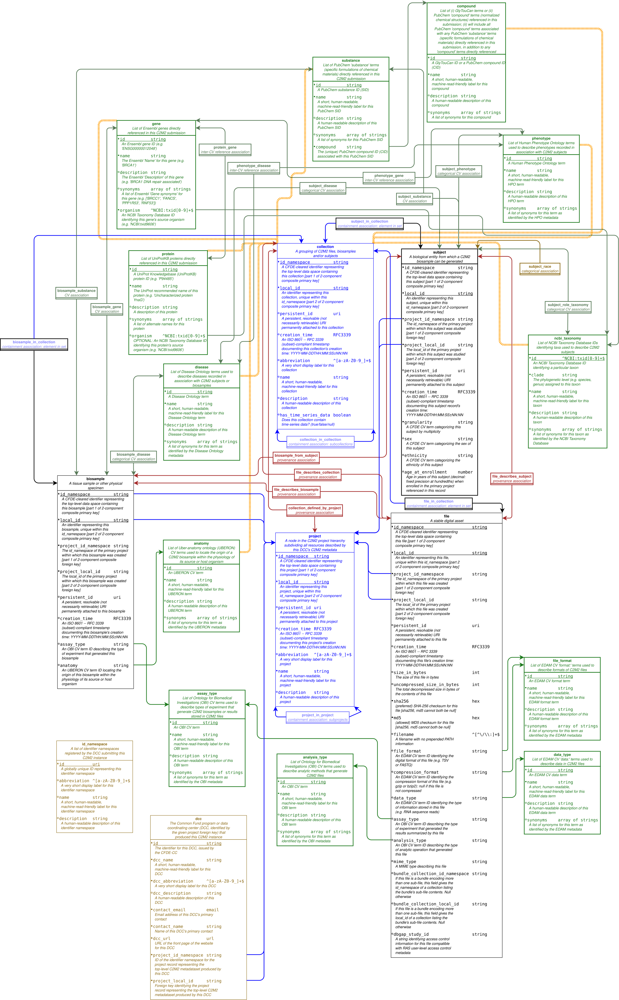

Important note: this specification is currently undergoing revision prior to our next
major release. DCC staff preparing current C2M2 submissions should consult the
[C2M2 technical wiki](https://github.com/nih-cfde/published-documentation/wiki)
for current C2M2 table definitions & usage guidance.

# QUICK-START BLOCK

* For DCC contributors: [C2M2 technical wiki](https://github.com/nih-cfde/published-documentation/wiki)
* Full [C2M2 technical specification](#c2m2-technical-specification) (skip introduction)
* [C2M2 ER diagram](#c2m2_model_diagram)
* Current [release notes](#c2m2-release-details)
* Upcoming [C2M2 features](#upcoming-c2m2-features) (next release)
* Download the [C2M2 JSON Schema](https://osf.io/c63aw/)
* Download a blank reference set of [all C2M2 TSV files](https://osf.io/rdeks/) (column-header lines only)
<!-- * sample C2M2 submission datapackages (populated with valid metadata):
   * [minimal asset inventory](https://osf.io/mqey3/)
   * [basic relational model](https://osf.io/wgvh6/) -->
<!-- * compliance checking: complete (terse) [list of C2M2 tables, fields & requirements](https://github.com/nih-cfde/published-documentation/wiki/C2M2-Table-Summary) -->

# The Common Fund Data Ecosystem's Crosscut Metadata Model (CFDE C2M2)

This document introduces the Crosscut Metadata Model
([C2M2](https://docs.nih-cfde.org/en/latest/CFDE-glossary/#c2m2)), a
flexible metadata standard for describing experimental resources in
biomedicine and related fields. The Common Fund Data Ecosystem
group is creating a new federated search infrastructure, with C2M2 as its
organizing principle, to offer the health research community access to an
unprecedented array of intersectional data and tools. The C2M2 system will
connect researchers with scale-powered statistical analysis
methods; deep, seamless searching across experimental data generated by
different projects and organizations; and new ways to aggregate
and integrate experimental data from different sources to
facilitate scientific replication and to drive new discoveries.

Using this new infrastructure, Common Fund Data Coordinating Centers
([DCCs](https://docs.nih-cfde.org/en/latest/CFDE-glossary/#dcc)) will
share structured, detailed information ([metadata](https://docs.nih-cfde.org/en/latest/CFDE-glossary/#metadata))
about their experimental resources with the research
community at large, widening and deepening access to usable
observational data. One of C2M2's primary missions is to support search
across cross-disciplinary datasets without moving or warehousing data. 
C2M2 is also designed to support large-scale analytic research,
for example by substantially reducing the effort needed to perform
meta-analysis of results produced by multiple independent teams
studying similar health-related phenomena.

## DCC metadata submissions

DCCs collect and provide metadata submissions
(C2M2 [instances](https://docs.nih-cfde.org/en/latest/CFDE-glossary/#c2m2-instance))
to CFDE describing experimental resources within their purview. Each
submission is a set of tab-separated value files
([TSVs](https://docs.nih-cfde.org/en/latest/CFDE-glossary/#tsv));
precise formatting requirements for these filesets are specified by
JSON Schema documents, each of which is an instance of the
[Data Package](http://frictionlessdata.io/docs/data-package/)
meta-specification published by the
[Frictionless Data](http://frictionlessdata.io/)
group. The Data Package meta-specification is a platform-agnostic toolkit for
defining format and content requirements for files so that
automatic validation can be performed on those files, just
as a database management system stores definitions for
database tables and automatically validates incoming data
based on those definitions. Using this toolkit, the C2M2 JSON
Schema specification defines
[foreign-key](https://docs.nih-cfde.org/en/latest/CFDE-glossary/#foreign-key)
relationships between metadata fields (TSV columns), rules
governing missing data, required content types and formats for
particular fields, and other similar database management
constraints. These architectural rules help to guarantee
the internal structural integrity of each C2M2 submission,
while also serving as a baseline standard to create
compatibility across multiple submissions received from different DCCs. During the
[C2M2 submission process](https://docs.nih-cfde.org/en/latest/CFDE-glossary/#c2m2-ingestion-process),
the CFDE software infrastructure uses these schematic specifications
to automatically validate format compliance and submission integrity
prior to loading C2M2 metadata into its central database. Once loaded,
C2M2 metadata will be used to fuel downstream services like web and API searching,
customized statistical summaries, dynamic display graphics, asset
browsing within experimental resource collections, and the automated
forwarding of stable, accessible experimental data files (inventoried
and annotated as part of a C2M2 metadata submission) to analytic workflow
environments.

## C2M2 overview

C2M2 offers DCCs a fairly sparse set of minimum structural
benchmarks to meet when building a submission. The general
idea is that DCC resource collections can initially be
represented quickly (and thus begin driving downstream
applications quickly) using metadata meeting minimal richness
requirements -- enough to provide a basic level of harmonization
with biomedical experimental metadata coming from other C2M2
sources (DCCs). Over time, DCC data managers can and should
upgrade their C2M2 metadata submissions by adding more detailed
descriptive information to their resource records; by
elaborating on provenance, timing and other relationships
between resources; and by working with the CFDE to expand C2M2
itself to better fit models and automation requirements already
in production elsewhere.

A C2M2 [submission](#dcc-metadata-submissions) (an "instance" or "datapackage") is a
collection of data tables encoded as tab-separated value files (TSVs).
Only three metadata records (three rows, across three C2M2 tables)
are strictly required, so most of these tables can optionally be
left empty in a minimally compliant submission. The three required records are

1. a short contact sheet (name, email, etc.) referencing the DCC technical contact responsible for the submission,
2. a single `project` record representing the submitting DCC itself (for resource attribution), and
3. at least one **identifier namespace**, registered in advance with the CFDE (to protect IDs used by the submitting DCC to represent files, samples, etc. from potential conflicts with identifiers generated independently by other DCCs -- see the [section on IDs](#c2m2-identifiers) for a full discussion of identifiers and namespaces in C2M2).

A minimally compliant submission -- containing just the
three required records and no more -- would clearly not be
of much use. The simplest _usable_ submission configuration
will also contain at least one nonempty data table (TSV)
representing a **flat inventory of experimental resources** (like
data files or biosamples). A more complex variant might similarly
inventory a few different resources like `biosamples`, `files` and
`subjects`, and then also encode **basic associative relationships**
between those resources: for example, asserting which `biosamples`
were materially descended from which `subjects`, or listing
which `files` have been analytically derived from which `biosamples`.
Beyond the single mandatory "this DCC owns this submission" record (2,
above), DCCs can also attach a hierarchy of `project` records to
their experimental metadata, to group resources by research purview.
Future submission variants will allow submitters to model
**events and timing** (both for provenance and to describe
time-indexed data), among other anticipated extensions. Core
structures (that is, C2M2 _core entities:_ fundamental types
of experimental resource) currently include `files`,
`biosamples` and `subjects`; more (including `gene`
and `chemical substance`) are scheduled to appear in the coming
months, based on direct collaboration with DCCs to model other
relevant, usable experimental metadata while keeping a continual
eye on maximizing harmonization and interoperability across the
whole C2M2 metadata space.

A foundational purpose of the C2M2 system is to facilitate
metadata harmonization: finding ways wherever possible to
represent comparable things in standard ways, without compromising
meaning, context or accuracy (although _precision_ may occasionally
be weakened so as to preserve the robustness of the rest). In
addition to building bridges and crosswalks between disparate but
related resources, C2M2 is also meant to facilitate the graded
introduction of metadata into the CFDE system, as discussed above.
The paradigm of gradually increasing submission complexity is
by design a (roughly) staged process: new layers of metadata
can be added according to increasing complexity and harmonization
difficulty, ranging from basic flat asset inventories to
well-decorated networks of relationships between resources that
are described in finer operational detail. In addition to
flattening the learning curve for onboarding DCC data managers
into the CFDE ecosystem, the ability to submit C2M2 metadata
in managed stages of complexity lets DCC data managers test
and see how downstream functionality is interacting with their
C2M2 metadata -- and, critically, to provide feedback to CFDE to
investigate and create any needed changes -- before investing
more heavily in creating more complex C2M2 submissions.

The full [C2M2 technical specification](#c2m2-technical-specification)
can be found below, which explains all available submission structures,
constraints and requirements in detail.

## DCC integration and the evolution of C2M2

Most DCCs already have some form of internal metadata model in use
for their own curation operations. C2M2 representation of similar but
distinct packages of important information, taken from multiple
independently-developed custom DCC metadata systems (e.g.
metadata describing people and organizations, data provenance,
experimental protocols, or detailed event sequences),
requires ongoing, iterative, case-based design and consensus-driven
decision-making, coordinated across multiple research groups.
Design and decision-making in such contexts requires
long-term planning, testing and execution. New metadata difficult to
integrate and harmonize will be handled by the creation of
generalizable, well-defined extensions to C2M2 if possible, and
by pruning (at least pro tem) if not. The core of the C2M2 data
space is tasked first with harmonizing relatively universal and
uncontroversial metadata concepts -- to be made stable and available
according to [FAIRness principles](https://docs.nih-cfde.org/en/latest/CFDE-glossary/#fair)
-- for streamlined submission construction and usable deployment
of DCC metadata. C2M2's second (longer-term) priority takes a
slower road to make robust decisions about integration of less
immediately tractable information, in concert with the Common
Fund community and an awareness of global standards.

With the flexible (but still well-defined) design of C2M2,
we seek to split the difference between the ease of evolution
inherent in a simple model and the operational power provided
to downstream applications by more complicated and difficult-to-maintain
extended frameworks.

This flexibility is also intended to simultaneously address the needs
of DCCs at widely different scales of data complexity or
funding depth, which will differ based on organization life-cycle
phases, scope of research purview, etc. DCCs with advanced,
operationalized metadata modeling systems of their own
should not encounter arbitrary barriers to C2M2 support for
more extensive relational modeling of their metadata if
they want it; newer or smaller DCCs, by contrast,
may not have enough readily-available information to feasibly
describe their experimental resources beyond giving basic
asset lists and project attributions. By committing both to
developing modular C2M2 extensions for the most advanced DCC
metadata and to offering simpler but well-structured model options
(already harmonized across C2M2 metadata from other
DCCs), we aim to minimize barriers to rapid entry into the C2M2
ecosystem and its downstream applications.

A C2M2 topic requiring special attention is the use of _identifiers_.

--------------------------------------------------------------------------------

## C2M2 identifiers

C2M2 is designed to be a framework for sharing information with the
global research community about useful experimental resources.
To be scientifically useful, this information (metadata) should be
**well-described** and **self-contained**: enough, at least, to
direct unambiguous future replication of the experiments involved.
More to the point, C2M2 metadata should also be directly
**reusable in new experiments** wherever possible.

C2M2 metadata is managed and curated by Common Fund DCCs
to standardize and stabilize it for future research use. CFDE's
explicit mission for C2M2 is to create an information archive that can
usefully serve researchers who work without guaranteed access to
follow-up information, including (among other scenarios) for
future work done after the funding lifecycle of each managing
DCC has ended.

C2M2 metadata is created at different times by different
DCCs working independently of one another. The first requirement
for any system trying to integrate such information is to provide
a standard way to unambiguously attach identifiers (IDs: formal names
or labels) to resources described by the C2M2 metadata submitted
by each DCC. As a minimum promise of structural integrity,
C2M2 requirements guarantee that C2M2 IDs used by each DCC will
not clash with any others in the system (present or future).

Beyond basic structural integrity, C2M2 also offers support for
optional citation-stable IDs which encode actionable information
that users or automated software can follow to further interact
with the resource named by the ID.

Resources represented as C2M2 entities (`file`, `biosample`,
`project`, etc.; see the
[C2M2 technical specification](#c2m2-technical-specification)
for scope and detail) **must** be identified with a C2M2 ID,
and **may also** be identified with a `persistent_id`.
C2M2 IDs ensure the basic structural integrity of the overall C2M2
system. Optional `persistent_id` identifiers are meant to be
stable enough to be scientifically cited, and to provide for further
investigation by accessing related resolver services.

To be used as a C2M2 `persistent_id`, an ID

1. will represent an explicit commitment by the managing DCC that the attachment of the ID to the resource it represents is **permanent and final**

2. must be a format-compliant [URI](https://tools.ietf.org/html/rfc3986) or a [compact identifier](https://n2t.net/e/compact_ids.html), where
the protocol (the "scheme" or "prefix") specified in the ID is registered with at least one of the following (see the given lists for examples of URIs and compact identifiers)

    * the IANA ([list of registered schemes](https://www.iana.org/assignments/uri-schemes/uri-schemes.xhtml))

        * scheme used must be assigned either "Permanent" or "Provisional" status

    * Identifiers.org ([list of registered prefixes](https://registry.identifiers.org/registry))

    * N2T (Name-To-Thing) ([list of registered prefixes](https://n2t.net/e/n2t_full_prefixes.yaml))

3. if representing a `file`, an ID used as a `persistent_id` **cannot** be
a direct-download URL for that `file`: it must instead be an identifier
permanently attached to the `file` and only **indirectly resolvable**
(through the scheme or prefix specified within the ID) to the `file` itself

These requirements constitute a minimal set of rules to ensure
that C2M2 resources can be stably cited in scientific literature
and automatically reused in future research. Clearly, though,
the production and maintenance of `persistent_ids` represents a substantial
investment of time, thought and effort, and we also emphasize
that not every C2M2 resource record that _can_ receive a `persistent_id`
will necessarily ever _need_ one. These IDs -- while representing a gold
standard for stability and long-term access -- are **strictly optional**.
DCCs should also note that without `persistent_ids`, digital
file assets represented in C2M2 will serve _only_ as inventory items and
annotated search results: permanent, indirected `persistent_ids` are
required in order to enable _any_ automated interoperability between actual
data files referenced by C2M2 records and external software systems (including
direct download access to files).

Since `persistent_id` is always optional, C2M2 provides a separate
structure to provide for universal identification: the basic **C2M2 ID** is
a two-part label comprised of a prefix (`id_namespace`)
and a suffix (`local_id`) which, concatenated, make up the ID.
C2M2 IDs fall into categories described by three main cases:

**[1]** A `persistent_id` already exists for the object being named.

   * if the `persistent_id` is a URI, then that URI should be split
   to form a C2M2 ID (see the [URI reference](https://tools.ietf.org/html/rfc3986)
   for precise definitions of terms like "scheme" and "path" in
   this context):

	   * `id_namespace` (prefix): `scheme://authority/`
	   * `local_id` (suffix): `path`
	   * Example: an SRA accession URI `https://www.ncbi.nlm.nih.gov/sra/SRX000007`
	   stored in C2M2 as a `persistent_id` would	be split, to form a corresponding
	   C2M2 ID, into

	      * an `id_namespace` prefix of `https://www.ncbi.nlm.nih.gov/sra/`
	      * and a `local_id` suffix of `SRX000007`

   * if the existing `persistent_id` is not a URI but instead is a compact identifier,
   it should be split similarly, with the details determined according to
   the particular format specification for the prefix being used: a scheme label and
   a reference to the issuing or owning authority (plus a delimiter) should constitute
   the `id_namespace` prefix, and the ID of the particular thing being referenced
   should be stored in the `local_id` suffix.

      * Example: the DOI compact identifier `doi:10.1006/jmbi.1998.2354` would be split into

         * an `id_namespace` prefix of `doi:10.1006/`, specifying the identifier type (`doi`) and the registered owner of the object (`10.1006`)
         * and a `local_id` suffix of `jmbi.1998.2354`

**[2]** A DCC already uses URIs to identify things that correspond to C2M2 entities (`files`,
`biosamples`, etc.), but those URIs don't meet all the criteria to be C2M2
`persistent_ids` (e.g. they're not guaranteed to be permanent). Such URIs
can still be split into an `id_namespace` prefix (containing a reference to the controlling
authority, e.g. the DCC or one of its organizational data sources) and a
`local_id` suffix (describing the object being identified) to form a C2M2 ID.
(For records with IDs built like this, `persistent_id` would be left blank.)

**[3]** A DCC only has local identifiers for such entities. In this case, each local
identifier will be the corresponding C2M2 `local_id` suffix (sanitized as necessary
for URI safety), and the `id_namespace` prefix can be constructed according to the
['tag' URI proposal](https://tools.ietf.org/html/rfc4151).

   * Example: The tag-URI-based `id_namespace`/`local_id` C2M2 ID for
   a C2M2 `biosample` record representing Sample A-867-5309 at
   the Flerbiger's Disease Project (FDP) -- a non-permanent, strictly local
   sample ID assigned by the FDP for their C2M2 submission built at the end
   of the first quarter of 2021 -- might be (an email address would also work in place of 'flerbiger.org' below)

      * `id_namespace`: `tag:flerbiger.org,2021-03-31:`
      * `local_id`: `A-867-5309`

--------------------------------------------------------------------------------

## C2M2 technical specification

The CFDE Crosscut Metadata Model (C2M2) is a relational database model
designed to encode scientifically usable metadata that describes
collections of accessible, standardized, and ideally replicable
resources and results relevant to research in biomedicine.

_Things_ are represented in C2M2 as **data tables**: specifically,
rectangular data matrices, each **row** of which is a **data record**
comprised of a small collection of named bits of data (**fields**).
Each field has an agreed-upon meaning that helps to describe
whatever "thing" the table represents; "things" (and the tables describing
them) can refer to physical objects, like numbered biosamples;
virtual objects, like digital files; or abstract concepts,
like a project or a standard name for "salmon louse."

_Relationships between things_ are represented as **associations**,
whereby data records describing things are linked together in
predefined ways so as to indicate that the linked things are
meaningfully connected in some way. One might for example
express the fact that

> beard biopsy number "BB44" was collected from a billy goat named Abner 

by

1. creating a record (representing the biopsy material
BB44) in a `biosample` table (representing all biosamples
being described), which might look like

`biosample`
| id | name | ... |
|:---|:---|:---:|
|BB44|goat beard biopsy number BB44|...|

2. creating a record (representing Abner) in a `subject` table (representing
all creatures from which biosamples have been taken), for example

`subject`
| id | species | age | ... |
|:---|:---|:---|:---:|
|Abner|goat|8|...|

3. using an _association table_ called "`biosample_from_subject`" to link
the two records together: "the given biopsy `biosample` (BB44) was sampled from the
given `subject` (Abner)", or

`biosample_from_subject`
| biosample | subject |
|:---|:---|
| BB44 | Abner |

Our hypothetical goat biosample annotation describes an association linking
records in two different data tables representing different types of thing
(`biosample` and `subject`) in a well-defined way. Associations can also
connect data records of the _same_ type of thing (i.e. within the same data
table). As an example,

> project RNA\_17.2 is a subproject of project RNA\_17

could be expressed by

* creating a record in a `project` table to represent `RNA_17`
* creating another record in the _same_ `project` table to represent `RNA_17.2`
* using an association like `project_in_project` to link the two records together:
`project` record `RNA_17.2` is a _subproject_ (`project_in_project`) of `project` record `RNA_17`.

(The example sketches above are intended only to illustrate the use of
association tables and do not precisely represent any particular C2M2
tables or fields.)

Following the literature we will be calling "things" **entities**.
The next graphic is an **entity-relationship (ER) diagram** describing
C2M2. Entities (things) are drawn as full tables: boxes with descriptions
of named fields. **Associations** (relationships between entities) are
named inside small boxes: arrows are drawn connecting each association with the
entities that participate in the relationship that the association represents.

|_C2M2 model diagram_|
|:---:|
||

Color key:

   *  Black: **Core entities** (basic experimental resources): `file`, `biosample` and `subject`
   *  Dark red: **Association relationships** between entities
   *  Blue: **Container entities** (`project` and `collection`) and their containment relationships
   *  Green: **Term entities** recording all standardized controlled-vocabulary terms submitted as C2M2 annotation metadata, plus extra descriptive information to facilitate user searching and web displays ([see below](#controlled-vocabularies-and-term-entity-tables) for details)
   *  Gold: **Administrative entities** giving basic contact information for DCC creators of C2M2 submissions and describing CFDE-registered, DCC-controlled identifier namespaces
   *  Yellow: `subject_role_taxonomy`: a special association relationship optionally linking each `subject` record with
      * (possibly multiple) NCBI Taxonomy IDs
      * a user-supplied group of sub-entities of a `subject` -- like "host," "pathogen," or "microbiome constituent" -- identified according to **roles** describing components of commonly observed biosystem types. ("Single organism (with no further subdivisions)" is the default **role**).

Each valid C2M2 submission will contain 26 tab-separated value (TSV)
files: one for each rectangle (entity or association) in the
ER diagram above. Formats for all 26 files and their constituent fields
are given in the [C2M2 JSON Schema](https://osf.io/e5tc2/), and blank example files
are provided for reference [here](https://osf.io/rdeks/). This schema
document is an instance of the [Data Package](http://frictionlessdata.io/docs/data-package/)
meta-specification published by the [Frictionless Data](http://frictionlessdata.io/)
group. It is a precise, machine-readable and (patient) human-readable JSON document
that explicitly describes and explains all the structural components of C2M2
as drawn in the diagram above. 

Each TSV file in a C2M2 submission will be a plain-text file representing a tabular
data matrix, with rows delimited by newlines and fields (columns) delimited
by tab characters. Field values in TSV files must conform to all formatting
constraints specified in the [C2M2 schema document](https://osf.io/e5tc2/);
other common relational database constraints (unique columns, non-nullable
fields, foreign key relationships) are also given in that document, which
defines the required relational data structure of a valid C2M2 submission.

A minimal set of additional _content_ requirements -- not expressible
as relational database constraints, but still required to support
downstream C2M2-driven automation -- complete the definition of a
fully valid C2M2 submission; these are given in this document, alongside
prose descriptions of the terse technical expressions in the C2M2
JSON Schema.

Only three metadata records (three rows, across three C2M2 tables)
are strictly required for a valid submission, so most TSV tables can
optionally be left empty in a minimally compliant submission. The three
required records are

1. a short contact sheet (name, email, etc.) referencing the primary DCC technical contact responsible for the submission,
2. a single `project` row representing the submitting DCC itself (for unambiguous resource attribution), and
3. at least one identifier namespace row in the `id_namespace` TSV file, registered in advance with the CFDE (to protect IDs used by the submitting DCC to represent files, samples, etc. from potential conflicts with identifiers generated independently by other DCCs -- see the [section on IDs](#c2m2-identifiers) for a full discussion of identifiers and namespaces in C2M2).

More information than this will clearly be required for a C2M2 metadata
submission to be of any _use,_  but regardless of individual metadata
configuration, **one TSV file must be created to represent each table,
whether or not the table has any row data in it**. Any blank table
will be represented by a TSV file containing just one tab-separated
header line which lists the (empty) table's field names. Instead of
just omitting files for tables with no data, this requirement helps
us differentiate "by design, no data is being submitted" from "this
table was left out by mistake."

### Common entity fields

The following fields all have the same meaning and serve the same function across
the various entity tables that include them (`file`, `biosample`, `project`, etc.).

The phrase "this entity," in field descriptions below, refers to the
particular entity (`file`, `biosample`, etc.) record stored in the
row containing the field in question. For example: when we describe
the `persistent_id` field as a "URI permanently attached to this
entity," we mean "for any particular row **_R_** in any C2M2 entity table,
if **_R_** contains a `persistent_id` value, then that `persistent_id` value
will be a URI uniquely and permanently associated with the particular
thing described by **_R_**." So if **_R_** is a row (describing one
particular file, say **_F_**) in a C2M2 `file` table, then any
value present in **_R_**'s `persistent_id` field must be an
identifier that's permanently attached to the file **_F_** (and to
nothing else).

In this document the terms "record" and "row" are generally synonymous:
one row in a C2M2 entity table represents a single metadata record -- an ordered
group of values organized according to named fields -- describing exactly one
entity of the type represented by that table. Example: one row in the `file`
entity table is a record describing a single file.

|field(s)|required?|description|
|:---:|:---:|:---|
| `id_namespace` | required: [primary key](https://en.wikipedia.org/wiki/Primary_key) | **URI-prefix identifier devised by the DCC managing this entity and pre-registered with CFDE-CC.** The value of this field will be used together with `local_id` as a **composite key structure formally identifying C2M2 entities** within the total C2M2 data space. The concatenation of `id_namespace` + `local_id` must form a valid URI. (See [C2M2 identifiers](#c2m2-identifiers) for discussion, examples and content restrictions.) |
| `local_id` | required: [primary key](https://en.wikipedia.org/wiki/Primary_key) | **URI-suffix identifier identifying this entity**: a string that **uniquely identifies each entity** within the scope defined by the accompanying `id_namespace` value. The value of this field will be used together with `id_namespace` as a **composite key structure formally identifying C2M2 entities** within the total C2M2 data space. The concatenation of `id_namespace` + `local_id` must form a valid URI. (See [C2M2 identifiers](#c2m2-identifiers) for discussion, examples and content restrictions.) |
| `persistent_id` | optional | **An optional, resolvable URI permanently attached to this entity**: a permanent address which must resolve (via some service like <a href="http://identifiers.org/">identifiers.org</a>) to some network-retrievable object describing the entity, like a landing page with basic descriptive information, or a direct-download URL. **Actual network locations (e.g. bare download URLs) must not be embedded directly within this identifier**: one level of indirection (the resolver service) is required in order to protect `persistent_id` values from changes in network location over time as data is moved around. (See [C2M2 identifiers](#c2m2-identifiers) for discussion, examples and content restrictions.) |
| `creation_time` | optional | An ISO 8601 / RFC 3339 (subset)-compliant timestamp documenting this entity's creation time (or, in the case of a `subject` entity, the time at which the `subject` was first documented by the primary `project` under which the `subject` was first observed): **`YYYY-MM-DDTHH:MM:SS±NN:NN`**, where <ul><li>**`YYYY`** is a four-digit Gregorian **year**</li><li>**`MM`** is a zero-padded, one-based, two-digit **month** between `01` and `12`, inclusive</li><li>**`DD`** is a zero-padded, one-based, two-digit **day** of the month between `01` and `31`, inclusive</li><li>**`HH`** is a zero-padded, zero-based, two-digit **hour** label between `00` and `23`, inclusive (12-hour time encoding is specifically prohibited)</li><li>**`MM`** and **`SS`** represent zero-padded, zero-based integers between `00` and `59`, inclusive, denoting Babylonian-sexagesimal **minutes** and **seconds**, respectively</li><li>**`±`** denotes exactly one of `+` or `-`, indicating the direction of the offset from GMT (Zulu) to the local time zone (or `-` in the special case encoded as `-00:00`, in which the local time zone is unknown or not asserted)</li><li>**`NN:NN`** represents the **hours:minutes** differential between GMT/Zulu and the local time zone context of this `creation_time` (qualified by the preceding `+` or `-` to indicate offset direction), with `-00:00` encoding the special case in which time zone is unknown or not asserted (`+00:00`, by contrast, denotes the GMT/UTC/Zulu time zone itself)</li></ul> Apart from the **time zone** segment of `creation_time` (**`±NN:NN`**, just described) and the **year** (**`YYYY`**) segment, **all other constituent segments of `creation_time` named here may be rendered as `00` to indicate a lack of available data** at the corresponding precision. |
| `abbreviation`, `name` and `description` | optional*† | **Text describing this entity**, to be used in C2M2 user interface displays showing row-level data. &nbsp; _Final length limits on these fields have not yet been established, but will be soon, so content in these fields should be kept as terse as possible. Expect a rough maximum of 10 characters for abbreviations, 25 chars for names and the length of a typical paper abstract for descriptions._ &nbsp; <ul><li>a short, alphanumeric, whitespace-free `abbreviation` (must match `/[a-zA-Z0-9_]+/`)</li><li>a terse but flexible `name`</li><li>an abstract-length `description`</li></ul> |
| `project_id_namespace`, `project_local_id` | required: `project` [foreign key](https://docs.nih-cfde.org/en/latest/CFDE-glossary/#foreign-key) | This pair of fields stores a **required [foreign key](https://docs.nih-cfde.org/en/latest/CFDE-glossary/#foreign-key) into this submission's `project` table**. The row in the `project` table identified by this key represents the **primary project under which this entity was first created, observed, documented or otherwise encountered.** (See the section on the [project table](#container-entities) for more on the meaning of `project` and usage details, including options for constructing simplified default values for these required fields.) |

*`primary_dcc_contact.dcc_abbreviation` and `primary_dcc_contact.dcc_name` are required fields, as is the value of
    `project.abbreviation` for one special `project` record representing the
    submitting DCC: see the [`primary_dcc_contact` table](#the-primary_dcc_contact-table)
    and [`project` table](#container-entities) sections, respectively, for details.
    `project.name` is also universally required (and must be unique to each project).

†the `name` field is required for all term tables (the green tables in the diagram above); note
that this information is automatically generated from existing ontology references
([see below](#controlled-vocabularies-and-term-entity-tables) for details on how these tables are built)

### Core C2M2 entities

#### The **`file`** entity: a stable digital asset

|field(s)|required?|description|
|:---:|:---:|:---|
| `id_namespace`, `local_id`, `project_id_namespace`, `project_local_id`, `persistent_id`, `creation_time` | ([see above](#common-entity-fields)) | (See [Common entity fields](#common-entity-fields) section) |
| `size_in_bytes` | optional | **The size of this `file` in bytes.** (integer) |
| `uncompressed_size_in_bytes` | optional | The **total decompressed size in bytes** of the contents of this file. (integer) |
| `sha256` | required if `md5` is null | **CFDE-preferred file checksum string**: the output of the SHA-256 cryptographic hash function after being run on this file. One or both of `sha256` and `md5` is required. |
| `md5` | required if `sha256` is null | **Permitted file checksum string**: the output of the MD5 message-digest algorithm after being run as a cryptographic hash function on this file. One or both of `sha256` and `md5` is required. |
| `filename` | optional | **A filename with no prepended PATH information.** (e.g. `example.txt` and not `/usr/foo/example.txt`) |
| `file_format` | optional | An **EDAM CV term ID** identifying the **digital format** of this file (e.g. `format:3475` for "TSV", or `format:1930` for "FASTQ"). |
| `data_type` | optional | An **EDAM CV term ID** identifying the **type of information** stored in this file (e.g. `data:3495` for "RNA sequence reads"). |
| `assay_type` | optional | An **OBI CV term ID** describing the **type of experiment** that generated the results summarized by this file. |
| `mime_type` | optional | A **MIME type** (or "IANA media type") describing this file, e.g. "text/plain" or "application/octet-stream". See [this page](https://training.nih-cfde.org/en/latest/CFDE-Internal-Training/MIME-type/) for a tutorial introduction and [this list](https://www.iana.org/assignments/media-types/media-types.xhtml) for a complete reference. |

#### The **`biosample`** entity: a tissue sample or other physical specimen

|field(s)|required?|description|
|:---:|:---:|:---|
| `id_namespace`, `local_id`, `project_id_namespace`, `project_local_id`, `persistent_id`, `creation_time` | ([see above](#common-entity-fields)) | (See [Common entity fields](#common-entity-fields) section) |
| `assay_type` | optional | An **OBI CV term ID** describing the **type of experiment** that generated this biosample. |
| `anatomy` | optional | An **UBERON CV term ID** used to locate the origin of this biosample within the physiology of a source organism. |

#### The **`subject`** entity: a biological entity from which a C2M2 biosample can be generated

|field(s)|required?|description|
|:---:|:---:|:---|
| `id_namespace`, `local_id`, `project_id_namespace`, `project_local_id`, `persistent_id`, `creation_time` | ([see above](#common-entity-fields)) | (See [Common entity fields](#common-entity-fields) section) |
| `granularity` | required | A CFDE-controlled vocabulary categorizing broad classes of possible biosample sources. |

The C2M2 `subject` entity is a generic data type meant to represent any biological
entity from which a `biosample` can be generated. (The notion of a `biosample`
being derived from another `biosample` will be modeled explicitly in future C2M2
versions; please [see the `biosample` section](#the-biosample-entity-a-tissue-sample-or-other-physical-specimen)
above for more.)

In addition to the [common entity fields](#common-entity-fields), C2M2 metadata includes
two details specific to `subject` entities: a **structural configuration**
called `granularity`, and **taxonomic labels**.

A required `granularity` field is included in each `subject` row and
contains one of a fixed list of categorical value codes. These codes
characterize each C2M2 `subject` record in the broadest possible terms:

|`subject.granularity` field value|name|description|
|---:|:---|:---|
| `cfde_subject_granularity:0` | single organism | One organism. |
| `cfde_subject_granularity:1` | symbiont system | A mixed system of consisting of two or more organisms (symbionts) in symbiosis (living colocated in time and space): one such symbiont may optionally be identified as a host. |
| `cfde_subject_granularity:2` | host-pathogen system | A special case of a symbiont system consisting of one symbiont, designated as a host, plus one or more other symbionts acting to create or sustain disease within the host organism. |
| `cfde_subject_granularity:3` | microbiome | A symbiont system consisting of a collection of (potentially unknown or partially characterized) taxa, where the environment in which the system resides is well-characterized, but the taxonomic composition of the system may be unknown; optionally contains one symbiont specially identified as a host. |
| `cfde_subject_granularity:4` | cell line | A cell line derived from one or more species or strains. |
| `cfde_subject_granularity:5` | synthetic | A synthetic biological entity. |

_This is a draft list for_ `granularity`: _we do not imagine it to be in its final form._

A reference table describing current `granularity` values and descriptions can be found
[here](https://osf.io/gpf3d/).

Taxonomic labels can also be attached to `subject` records. For the most basic "single
organism" `granularity`, this will be a one-to-one relationship: "this `subject` was a
member of _`Speciesella exemplarensis`_." On the other hand, since a C2M2 `subject` entity can
represent more complex `biosample` sources, like an entire microbiome or a
multi-organism symbiont system, more complex `granularity` types may require that
multiple parallel taxonomic labels be attached to a single `subject` record.
The C2M2 `subject_role_taxonomy` table provides a way to do this by linking
taxonomic labels to `subject` records while also specifying, for each such
label, which sort of `subject` subcomponent (categorized as a "**role**"; [see
below](#taxonomy-and-the-subject-entity-the-subject_role_taxonomy-association-table))
the label should be attached to. For example, the information "host: _Homo sapiens_;
pathogen: _Francisella tularensis_" could be attached to a single `subject` record
representing a biopsy from a (human-based) "host-pathogen-system". Please see the [section below on
`subject_role_taxonomy`](#taxonomy-and-the-subject-entity-the-subject_role_taxonomy-association-table)
for all the details on how to use this table.

### Association tables: inter-entity linkages

C2M2 **association tables** codify relationships between specific entities
of different types: in database terms, they spell out relationships between
particular rows across different tables.

   * `file_describes_subject`

Each row in the C2M2 `file_describes_subject` association table consists of
two identifiers, used as foreign keys: one for a `file` record (a row in the
`file` table describing one particular file), and one for a `subject` record
(a row in the `subject` table describing one particular subject or source organism).
Since C2M2 identifiers each have two parts -- `id_namespace` and `local_id` --
this gives a total of four fields for this table:

|`file_id_namespace` | `file_local_id` | `subject_id_namespace` | `subject_local_id` |

Each row of `file_describes_subject` declares that some particular file _F_ contains
data describing a particular subject _S_. The file _F_ is identified by C2M2 ID
(`file_id_namespace` + `file_local_id`) as a specific row in the C2M2 `file` table;
the subject _S_ is similarly referenced (`subject_id_namespace` + `subject_local_id`) as
a particular row in the `subject` table.

The following tables work in the same way:

   * `file_describes_biosample`
   * `biosample_from_subject`
   * `collection_defined_by_project`
   * `file_describes_collection` (for any file describing an entire C2M2 `collection`)

**These association tables are optional**: valid C2M2 submissions do not need
to express all (or indeed any) of these relationships. If included, association table
information about relationships between entities can be used to power smarter
downstream discovery than would be possible if limited only to manifests of
isolated, unlinked resources.

Each association table's name defines the relationship it represents, and these
are generally nonspecific by design, to facilitate harmonization along basic
conceptual lines across the federated C2M2 metadata space. `collection_defined_by_project`
optionally attaches a primary generating `project` to a C2M2 `collection`:
this relationship is more specific than the others given here, and is meant
to express the same relationship between a `project` and a `collection` as
is (for example) expressed by the `project` foreign key in the `file` table:
"`collection` _C_ was defined under the auspices of `project` _P_," just as "`file` _F_
was created by `project` _P_," or "`biosample` _B_ was obtained and catalogued
during project _P_." Not every `collection` will have a well-defined DCC-modeled
`project` under which it was created, so the `collection_defined_by_project`
association is optional.

Please see the relevant sections of the [C2M2 JSON Schema](https://osf.io/e5tc2/) to
find all field names and foreign-key constraints for these tables.

### Container entities

C2M2 offers two ways -- `project` and `collection` -- to define **groups of
related entities** (`file`, `subject`, `biosample`, etc.). All valid
C2M2 submissions must provide at least minimal information describing a `project`
hierarchy, with each metadata record attached to a well-defined `project` space.
Operations essential to data discovery (sorting, searching and binning) depend
on this information, so that as data is discovered by users, it can be more easily
associated with its proper research context. The C2M2 `collection` container,
a generalization of "dataset", is optional, with its scope and complexity of usage
generally left to the submitting DCC.

#### `project`

The C2M2 `project` entity models an unambiguous, unique, named, most-proximate
research/administrative sphere of operations that **first generates or observes**
experimental resources represented by core C2M2 entities (`file`, `subject`, etc.).
The concept of `project` is loosely rooted in -- but not necessarily mapped
one-to-one from -- some corresponding hierarchy of grants, contracts or other
**important administrative subdivisions of primary research purview.** Specifically
what that means -- exactly what these administrative subdivisions are, and how
metadata is to be allocated to them -- is left to the submitting DCC, subject to
the structural constraints we impose on `project` in anticipation of using it
consistently across metadata spaces from different DCCs.

The `project` hierarchy described by any valid C2M2 submission must represent
a directed, rooted, acyclic graph (a directed tree). Nodes (vertices) on this
tree are represented as rows in the C2M2 `project` table. Edges between pairs
of nodes, representing parent/child relationships between projects (or more
awkwardly "containing project"/"subproject" relationships), are expressed
as rows in the `project_in_project` association table ([see
below](#association-tables-expressing-containment-relationships)). Each row in `project_in_project`
lists one parent project and one child project; taken together, all of
the rows in `project_in_project` represent the entire `project` tree hierarchy
within the submission.

Regardless of whether a DCC has a natural "top-level project" under which
to nest all other `project` records, **C2M2 requires by convention that one
artificial `project` row be created and identified as the root node of the
`project` hierarchy: this node will represent the DCC itself.** This row is
referenced via foreign key by the contact entry in the `primary_dcc_contact` table
([see below](#the-primary_dcc_contact-table)), and serves as an anchor point for creating roll-up summaries
or other aggregations of C2M2 metadata arranged according to submitting DCC.

A unique `project` attribution is **required** for each row of all core entity
types: foreign keys ([discussed above](#common-entity-fields)) are provided
for this purpose in the `file`, `biosample` and `subject` tables. In a truly
minimal case, a DCC's `project` hierarchy can just consist of the artificial
root node representing the DCC itself, and all resources can be attributed to
that one node. This will disable any downstream advantages of more fine-grained
accounting, but will enable a valid submission.

#### `collection`

**The C2M2 `collection` entity is a generalization of "dataset."** Elements of
a `collection` can be data resources like the C2M2 `file` entity, but a
`collection` can also contain non-data entities (e.g. `biosample` or `subject`).
It is meant to serve as a generic container for grouping related core C2M2
entities; no semantic context, superstructure, or usage assumptions are built
in. The `collection` entity should be used to represent all relevant, extant
groupings of experimental resources represented as C2M2 core entities, especially
those with already-created permanent and citation-ready identifiers (e.g. datasets
for which DOIs have been registered). Eventually we expect to offer
researchers using C2M2 metadata the opportunity to define and cite `collection`
entities federating existing C2M2 resources across multiple source DCCs: providing
the ability to **stably cite groups of C2M2 resources** is in fact the central
purpose of `collection`. As a structural support for FAIRness principles
within CFDE, the C2M2 `collection` entity is designed to facilitate reliable
reuse and reanalysis of Common Fund data and metadata.

In terms of minimal valid C2M2 submissions, `collection` is **entirely optional**:
DCC metadata need not necessarily include any `collection` records or attributions.

Membership of core C2M2 entities in a `collection` is expressed with the
relevant ("`X_in_collection`") association tables; nested `collection`
entities are listed in the `collection_in_collection` association
table. ([See below](#association-tables-expressing-containment-relationships)
for complete usage details.)

We emphasize that **no relationship is assumed between `project` and `collection`.**
A `collection` **may optionally** be attributed to a primary (defining or
generating) C2M2 `project` -- via the `collection_defined_by_project`
association table ([see above](#association-tables-inter-entity-linkages)) --
but **`collection`-`project` associations will not even always be well-defined,**
and are not at all required. We expect eventually to extend the ability to
define new `collection` entities, on an ongoing basis, to interested community
members (beyond DCC data managers) whose work may not be related to any C2M2
`project` records and whose new `collection` entities won't be attributable
in this way.

### Association tables: expressing containment relationships

   * `project_in_project`
   * `collection_in_collection`
   * `file_in_collection`
   * `subject_in_collection`
   * `biosample_in_collection`
   
These tables are used to express basic containment relationships like "this `file` is in
this `collection`" or "this `project` is a sub-project of this other
`project`." Rows in these tables consist of four fields:
   
* two (an `id_namespace` and a `local_id`) comprising a foreign key representing
   the **containing `project` or `collection`**, and
* two (a second {`id_namespace`, `local_id`} pair) acting as a foreign key
    referencing the **contained resource** (`file`, `biosample`, etc.) **or group**
    (e.g., a "child `project`" or subproject).

Example set of fields (from `project_in_project`):

|`parent_project_id_namespace` | `parent_project_local_id` | `child_project_id_namespace` | `child_project_local_id` |

Another example (from `file_in_collection`):

|`file_id_namespace` | `file_local_id` | `collection_id_namespace` | `collection_local_id` |

Please see the relevant sections of the [C2M2 JSON Schema](https://osf.io/e5tc2/)
to find all field names and foreign-key constraints for each of these association tables.

### Taxonomy and the `subject` entity: the `subject_role_taxonomy` association table

In [the `subject`
section](#the-subject-entity-a-biological-entity-from-which-a-c2m2-biosample-can-be-generated)
above, we introduced the idea of flexibly attaching (possibly multiple) taxonomic labels
to `subject` records. For the most basic "single organism" `granularity`, such
a labeling will be a straightforward one-to-one map: "`subject S-24601` was a
member of _`Speciesella exemplarensis`_." On the other hand, since a C2M2 `subject`
entity can represent more complex types of `biosample` sources -- like a multi-organism
symbiont system -- more complex `granularity` types may require that several
taxonomic labels be attached to a single `subject` record in parallel, to directly
describe the various constituent components of the `subject`. The `subject_role_taxonomy`
is a **ternary association table**; each row contains _three_ identifiers:

1. the **C2M2 ID** (`id_namespace`+`local_id`) of a `subject` record
2. a **`role_id`** drawn from a preset list of `subject` sub-component types:

|`subject_role_taxonomy.role_id` field value|name|description|
|---:|:---|:---|
| `cfde_subject_role:0` | single organism | The organism represented by a `subject` in the 'single organism' granularity category |
| `cfde_subject_role:1` | host | Any organism identified as a host for a `subject` assigned to the 'symbiont system', 'host-pathogen system', or 'microbiome' `granularity` categories |
| `cfde_subject_role:2` | symbiont | An organism identified as a symbiont within a `subject` assigned to the 'symbiont system' `granularity` category |
| `cfde_subject_role:3` | pathogen | An organism identified as a pathogen symbiont in a `subject` assigned to the 'host-pathogen system' `granularity` category |
| `cfde_subject_role:4` | microbiome taxon | A constituent taxon of a `subject` assigned to the 'microbiome' `granularity` category |
| `cfde_subject_role:5` | cell line ancestor | A taxon identified as a source organism for a `subject` assigned to the 'cell line' `granularity` category |
| `cfde_subject_role:6` | synthetic | A synthetic biological entity |

_(This is a draft list for_ `role_id`: _we do not imagine it to be in its final form.)_

A reference table describing current `subject_role` values and descriptions can be found
[here](https://osf.io/fapnr/).

3. a **taxonomic label** (specifically, an identifier of the form `NCBI:txid######`,
where `######` is the numeric ID of the desired label in the NCBI Taxonomy database)

Each row in `subject_role_taxonomy` thus attaches one taxonomic label to one `subject`
via one specified `role_id` subcomponent type.

For example, the information "host: _Homo sapiens_; pathogen: _Francisella tularensis_"
could be attached to a single `subject` record -- representing a biopsy from a
(human-based) "host-pathogen-system" -- by doing the following three things (`||` symbols represent
tab characters separating TSV fields, in the example rows below):

1. setting the `granularity` of the `subject` record (in the `subject` table)
    to `cfde_subject_granularity:2` ("host-pathogen system": see
    [here](#the-subject-entity-a-biological-entity-from-which-a-c2m2-biosample-can-be-generated)
    for the complete list)

> `id_namespace: DCC_X_namespace || local_id: SUBJ_24601 || [...] || granularity: cfde_subject_granularity:2`    

2. adding one row to `subject_role_taxonomy` specifying that the host of the `subject` system is _Homo sapiens_

> `subject_id_namespace: DCC_X_namespace || subject_local_id: SUBJ_24601 || role_id: cfde_subject_role:1 || taxonomy_id: NCBI:txid9606`

3. adding one more row to `subject_role_taxonomy` specifying _F. tularensis_ as a pathogen in the `subject` system

> `subject_id_namespace: DCC_X_namespace || subject_local_id: SUBJ_24601 || role_id: cfde_subject_role:3 || taxonomy_id: NCBI:txid263`

### Controlled vocabularies and term entity tables

Support for the **detailed description of C2M2 metadata with terms from standard
scientific ontologies** is a key component of cross-collection metadata
harmonization within the CFDE. C2M2 currently provides a small number of
(relatively uncontroversial) fields through which controlled (standardized,
curated) scientific vocabulary terms can be attached to core C2M2 entities.

At present all C2M2 controlled vocabulary annotations are **optional**. Curated
ontologies currently supplying supported term sets are

* the [Disease Ontology (DO)](https://disease-ontology.org/)
* the [Ontology for Biomedical Investigations (OBI)](http://obi-ontology.org/)
    (a good browser is available at [EMBL-EBI](https://www.ebi.ac.uk/ols/ontologies/obi))
* the [Uber-Anatomy Ontology (UBERON)](https://www.ebi.ac.uk/ols/ontologies/uberon)
* the [NCBI Taxonomy](https://www.ncbi.nlm.nih.gov/taxonomy)
* [EDAM](http://edamontology.org), an ontology for bioinformatics concepts including
    data types and formats ([browser](https://www.ebi.ac.uk/ols/ontologies/edam))

The following table lists all current C2M2 controlled vocabulary fields: each CV field
is listed as `C2M2_entity_table.field_name`. We list the source ontology for each
field along with a general description of that field's intended annotation context
within C2M2.

|CV field|ontology|description|
|---:|:---|:---|
| `file.assay_type` | OBI | the **type of experiment** that produced a `file` |
| `file.file_format` | EDAM | the **digital format or encoding** of a `file` (e.g. "FASTQ") |
| `file.data_type` | EDAM | the **type of information** contained in a `file` (e.g. "sequence data") |
| `biosample.assay_type` | OBI | the **type of experiment** that produced a `biosample` |
| `biosample.anatomy` | UBERON | the **physiological source location** in or on the `subject` from which a `biosample` was derived |
| `ncbi_taxonomy.id` | NCBI Taxonomy | a **taxonomic name** associated with a `subject` record (usage details [discussed above](#taxonomy-and-the-subject-entity-the-subject_role_taxonomy-association-table)) |

In addition to these fields, (possibly multiple) diseases can be optionally
associated with each `biosample` or `subject` record via the `biosample_disease` and
`subject_disease` tables, which connect `biosamples` or `subjects` (via their C2M2 IDs)
to [Disease Ontology](https://disease-ontology.org/) terms.

Submitters should use bare CV terms in the relevant fields (e.g.
`file.file_format` might be populated with `format:1930` to express that the
containing record represents a FASTQ-formatted file). In the case of NCBI Taxon
IDs, which are integers in their "barest" form, values should be encoded as
`NCBI:txid####`, where the `####` suffix represents the integer ID of the taxon in
question: _Homo sapiens_ would thus be represented as `NCBI:txid9606`.

Note again that **all CV fields are optional**: if any of these annotations is
unavailable or inappropriate for particular C2M2 records, or if the supported
ontologies prevent proper encoding of the relevant information, then the associated CV
fields (or records in CV association tables like `biosample_disease`) can and
should be left blank.

If sufficiently specific terms cannot be found in the supported ontologies, we
encourage DCC data managers to provisionally include more general ancestor terms
(as available), and simultaneously to contact the CFDE Ontology Working Group with
descriptions of any needed additions to the supported controlled vocabularies. CFDE
has established direct update channels with the curation authorities for each
supported ontology, and the Ontology WG explicitly aims to expedite the addition of any
missing terms on behalf of Common Fund DCCs, rather than forcing bad choices.

For each controlled vocabulary supported by C2M2, a **term table** must
be included as part of any valid submission. (These are the green tables in the 
[ER diagram](#c2m2_model_diagram) above.) Each such table will contain one
row for each (unique) CV term used anywhere in the containing C2M2 submission,
along with basic descriptive information for each term (to empower both
downstream user searches and automated display interfaces). All term metadata is
to be automatically loaded directly from the ontology reference data: green term-tracker
tables **_should not be built by hand_** by DCC staff preparing submissions. Instead,
the other C2M2 entity and association tables should be prepared _first_, with CV
terms included in the appropriate fields. Once these are built, a [CFDE-provided
script](https://osf.io/bq6k9/) must be used to automatically scan the prepared
tables. The script will find all CV terms used throughout the submission, validate
them against externally-provided ontology reference files, and then combine
this information with descriptive data drawn directly from the reference files,
to automatically build all necessary (green) term tables. These automatically-generated
term tables (TSVs) are then to be bundled along with the rest of the C2M2 submission
(as prepared directly by the DCC data management team).

### The `primary_dcc_contact` table

|field(s)|required?|description|
|:---:|:---:|:---|
| `contact_email` | required: [primary key](https://en.wikipedia.org/wiki/Primary_key) | Email address of the primary DCC contact for this C2M2 submission. (Format: valid email address) |
| `contact_name` | required | Name of this DCC contact. |
| `project_id_namespace`, `project_local_id` | required: `project` [foreign key](https://docs.nih-cfde.org/en/latest/CFDE-glossary/#foreign-key) | The `id_namespace` and `local_id` fields of the `project` row representing this contact's DCC. |
| `dcc_abbreviation` | required | A short label for this contact's DCC. (Pattern: `[a-zA-Z0-9_]+`) |
| `dcc_name` | required | A short, human-readable, machine-read-friendly label for this contact's DCC. |
| `dcc_description` | optional | A paragraph-length description of this contact's DCC. |
| `dcc_url` | required | URL of the front page of the website for this contact's DCC. |

--------------------------------------------------------------------------------

## C2M2 release details

FEB 2022 RELEASE

* add `file.analysis_type` (OBI)
* clarifications for `subject.sex` minimal enum values
* add negative assertion option to `disease` associations
    * `subject_disease` can now document "disease ruled out" in addition to "disease detected"
    * `biosample_disease` similarly augmented
* add `phenotype` observation data (new CV: [Human Phenotype Ontology](https://hpo.jax.org/app/))
    * `subject_phenotype` (positive & negative assertions permitted)
    * reference tables `phenotype_disease` and `phenotype_gene` (imported directly from HPO)
* add `collection_disease` and `collection_phenotype` to provide associations between C2M2 collections and `disease` and `phenotype` terms
* updated [term builder script](https://osf.io/bq6k9/) to handle new components
    * _HPO integration is currently being tested for final deployment: please [get in touch with us](https://github.com/nih-cfde/published-documentation/wiki/) if you wish to use the phenotype ontology before this process is complete_

NOV 2021 RELEASE

* new entities: `compound`, `substance`
    * simplified mirror of same-named PubChem structures
    * meant to model "small molecules" of various types (e.g. drugs)
        * _not_ proteins or genes or other abstract structures with
        more baggage than "unambiguous chemical compound" -- such will be modeled separately later on
    * new associations: `biosample_substance`, `subject_substance`
* new entity: `gene`
    * prototype: list of Ensembl IDs as a CV with metadata describing names, synonyms and source organisms
    * `biosample_gene` association added as a limited prototype for knockout data
* new fields on `subject` for (public) clinical metadata:
    * `sex`, `race` (multi-select-capable), `ethnicity`, `age_at_enrollment`, `age_at_sampling` (as `biosample_from_subject.age_at_sampling`)
* `primary_dcc_contact` renamed to `dcc`; `id` field added; mirrors portal registry data
* new `bundle_collection` foreign key from `file` into `collection`
    * allows enumeration of contents of archive files containing multiple subfiles (e.g. TAR archive files)
* new `file.compression_format` CV (EDAM) for clearer expression of file compression configurations
* updated [term builder script](https://osf.io/bq6k9/) to handle new components

SEP 2021 RELEASE

* removed regex pattern constraints on included CV terms
    * OBI, for example, imports terms from other ontologies: being pattern-proscriptive
    about this proved impossible. We now just directly check each detected term against
    the ontology's reference store.
* added `disease` (support for Disease Ontology terms) plus `biosample_disease`
and `subject_disease` associations
* added (auto-built) `synonyms` fields (JSON arrays) to CV term tables
* added `file_describes_collection`
* added `biosample.assay_type`
* restored `id_namespace` foreign key assertions to `file`, `biosample`, `subject`,
`project`, `collection`
* tightened constraints on most `name` fields
    * required, unique: see [above](#common-entity-fields) for full usage details
* updated [term builder script](https://osf.io/bq6k9/)
    * now handles `disease`
    * now handles `ncbi_taxonomy`
    * other stability improvements
    * construction of all (green) CV-usage tables now fully automated as of this release

--------------------------------------------------------------------------------

## Upcoming C2M2 features

All future plans are subject to change until their release dates.

MAY 2022 RELEASE

_**We are attempting to expedite this C2M2 update for a release near the beginning of April** so that data can be submitted with the new features in advance of the planned May 1 portal release. We aim to publish a final development-level schema at the end of February, with integration testing to follow throughout March. If actual release dates are delayed past current expectations, we will still work with any interested Programs to prepare submissions using the new features for the May portal release._

* `collection.name` will be required
* Boolean `collection.has_time_series_data` will offer basic annotation to reach users looking for time series datasets
* New field `file.RAS_permission_string` to support initial stand-up integrating RAS permissions metadata with the CFDE UI
* Add `collection_gene`, `collection_compound`, `collection_substance`, `collection_taxonomy`, `collection_anatomy` to provide associations between C2M2 collections and terms in relevant controlled vocabularies
* Extend usage of C2M2 `compound` table to include partial-knowledge glycans not tracked by PubChem
* Add subject `role` category for _expression system_ (e.g. _E. coli_ modified to express nonnative gene products)
* Add a `protein` CV ([UniProt](https://www.uniprot.org/) IDs & descriptions)
    * _associations TBD_

_**Related note:** During Q4 we will be creating a **system for attaching web-displayable markdown to C2M2 controlled vocabulary (CV) terms**. Common Fund Programs will be able to offer (among other information) knowledgebase-style assertions about any C2M2 concepts modeled as CVs (genes, diseases, etc.), as well as links to related offsite resources.  This system will be developed outside the C2M2 per se, but will be linked to C2M2 submission data via reference to the CV terms in use therein._

ONGOING

* comprehensive client-side [datapackage prep & validation software](https://osf.io/bq6k9/)
    * note: this is distinct from the [CFDE submission tool](https://docs.nih-cfde.org/en/latest/cfde-submit/docs/); the software linked here is to be run _before_ submitting a C2M2 datapackage to CFDE

--------------------------------------------------------------------------------
