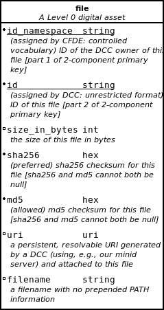
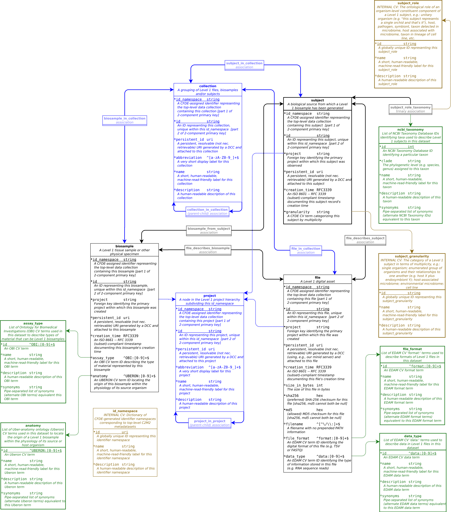

# The Common Fund Data Ecosystem's Crosscut Metadata Model (CFDE C2M2)

This document introduces the Crosscut Metadata Model (C2M2),
a flexible standard for describing biomedical experimental
data. The Common Fund Data Ecosystem group is creating a new
infrastructure, with C2M2 as its central concept, through
which powerful cross-dataset searches, custom aggregation
of experimental data and scale-powered statistical analysis
methods will be made possible for the biomedical research
community at an unprecedented scope.

Using this new infrastructure, data coordinating centers
([DCCs](../draft-CFDE_glossary/glossary.md#DCCs)) can
share structured information ([metadata](../draft-CFDE_glossary/glossary.md#metadata))
about their experimental resources with the research
community, widening and deepening access to usable
observational data and accelerating discovery.

## DCC Metadata Submissions

DCCs will collect and provide metadata to CFDE describing
experimental resources within their purview. Each metadata
submission will take the form of a collection of tab-separated value
files (TSVs): precise formatting requirements for these TSV
collections will be specified by JSON Schema documents
implementing the [Data Package](http://frictionlessdata.io/docs/data-package/)
meta-specification published by the [Frictionless Data](http://frictionlessdata.io/)
group. These schemas will be used by the CFDE software
infrastructure to automatically validate submission format compliance
and metadata integrity during the [ingestion process](../draft-CFDE_glossary/glossary.md#DCC-data-ingestion-process).

CFDE will offer DCCs multiple alternatives for metadata submission
formats, all of which will be automatically interoperable with the
C2M2 ecosystem. These alternative formats are arranged in
levels tiered according to increasing complexity, reflecting
anticipated differences in the relative richness of metadata
available to different DCCs at any particular time. The general
expectation will be that the metadata submitted and managed by a
DCC will be able to transition, over time, through
increasingly rich modeling levels -- enabling increasingly powerful downstream
applications -- as the life cycle of DCC/CFDE technical interaction
progresses.

## C2M2 Richness Levels

In its [fullest form](../draft-C2M2_ER_diagrams/full-C2M2-ER-model.png),
C2M2 is an [entity-relationship system](../draft-CFDE_glossary/glossary.md#entity-relationship-model)
that models common properties of resources fundamental
to biomedical research like subjects, digital files,
events, samples, and project datasets. Essential
relationships between these fundamental resources are also formally described,
documenting (for example) the samples that were processed
to produce a particular data file; which subject a given sample was
drawn from (possibly obfuscated to protect patient privacy); or when
a particular blood pressure measurement was made.

Modeling and data wrangling are always difficult, even for
experts. Requiring every DCC to model their metadata using
all possible features of the [full C2M2 model](../draft-C2M2_ER_diagrams/full-C2M2-ER-model.png)
as a precondition for submitting metadata to CFDE would
be infeasible for several important reasons (apart from
creating avoidable and unnecessary onboarding delays).
Perhaps the most operationally relevant of these is that
the C2M2 model must remain as flexible as possible, especially
during its developmental phases, in order to accomodate mutual learning
between DCCs and CFDE as the process of data ingestion
develops. It is far more expensive and error-prone to
repeatedly change a complex model than it is to build
one gradually from a simpler core concept which is allowed
to stabilize before more specialized branches are allowed
to solidify.

With the design of C2M2, we are splitting the difference
between the ease of evolution inherent in a simple model and
the operational power provided to downstream applications by more
complicated and difficult-to-maintain frameworks.
DCCs with advanced, operationalized metadata modeling
systems of their own should not encounter arbitrary
barriers to CFDE support for more extensive relational
modeling of their metadata if they want it; CFDE will
maintain such support by iteratively refining the
[full C2M2 model](../draft-C2M2_ER_diagrams/full-C2M2-ER-model.png)
according to needs identified while working with
more operationally advanced DCCs. Newer or smaller DCCs, by contrast, may
not currently have enough readily-available information
to feasibly describe their experimental resources using the
most complex C2M2 modeling level: CFDE will support
cases like these by offering simpler but still well-structured
metadata models, lowering some of the barriers to rapid
entry into the data ecosystem.

Simpler C2M2 metadata models must be maintained by
CFDE in such a way as to maximize interoperability with
more complex C2M2 variants, and the whole system should be
structured to minimize the negative side effects of model
changes. These considerations have led to the
creation of C2M2 [richness levels](../draft-CFDE_glossary/glossary.md#richness-levels):
concentric, canonical variants of C2M2 which are benchmarked at
increasing levels of model complexity and detail, wherein each successive
modeling level is a value-added superset of all of the metadata
encompassed by the previous (less complex) level.

Accordingly, CFDE presently offers two less complex C2M2 variants
in addition to the full C2M2 model:
[Level 0](#level-0) (basic metadata describing a collection of digital files) and
[Level 1](#level-1) (which introduces models for core experimental
resources like samples and subjects; a rudimentary set of search targets
in the form of annotations like the anatomical location of
the source for a human tissue sample or taxonomic data describing
sample source organisms and study subjects; and basic support for arranging
experimental resources into sub-collections based on a
hierarchy of projects, studies or other similar subdivisions
of research ownership and responsibility).

_Proposals for Levels 2 and 3 currently exist in
[first-round rough brainstorm draft form](../draft-C2M2_Levels_spreadsheets/Level_definitions.csv) only._

---

### Level 0

C2M2 Level 0 defines a **minimal valid C2M2 instance.** Data submissions
at this level of metadata richness will be the easiest to produce, and will
support the simplest available functionality implemented by
downstream applications.

#### Level 0 submission process: overview

Metadata submissions at Level 0 will consist of a single TSV
file describing a **collection of digital
files** owned or managed by a DCC. The properties listed
for the Level 0 `file` entity (see below for
diagram and definitions) will serve as the TSV's column
headers; each TSV row will represent a single file. The
Level 0 TSV itself thus represents a
**[manifest](../draft-CFDE_glossary/glossary.md#CFDE-asset-manifest)
or inventory** of digital files that a DCC wants to
introduce into the C2M2 metadata ecosystem.

This level encodes the most basic file metadata:
its use by downstream applications will be
limited to informing the least specific level of data
accounting, querying and reporting.

|_Level 0 model diagram_|
|:---:|
||

#### Level 0 technical specification: properties of the `file` entity

**Required: `id_namespace` `id` `sha256|md5`**

|property|description|
|:---:|:---|
| `id_namespace` | String **identifier assigned by CFDE to the DCC managing this `file`**. The value of this property will be used together with `id` (assigned to each `file` by the DCC that owns it) as a **paired-key structure formally identifying Level 0 `file` entities** within the total C2M2 data space.|
| `id` | Unrestricted-format **string identifying this `file`, assigned by the DCC managing it**. Can be any string as long as it **uniquely identifies each `file`** within the scope of a single Level 0 metadata submission. |
| `size_in_bytes` | The **size of this `file` in bytes**. This varies (even for "copies" of the same `file`) across differences in storage hardware and operating system. CFDE does not require any particular method of byte computation: file size integrity metadata will be provided in the form of checksum data in the `sha256` and/or `md5` properties. `size_in_bytes` will instead underpin automatic reporting of basic storage statistics across different C2M2 collections of DCC metadata.|
| `sha256` | **CFDE-preferred** file checksum string: the output of the SHA-256 cryptographic hash function after being run on this `file`. One or both of `sha256` and `md5` is required. |
| `md5` | **Permitted** file checksum string: the output of the MD5 message-digest algorithm after being run as a cryptographic hash function on this `file`. One or both of `sha256` and `md5` is required. (CFDE recommends SHA-256 if feasible, but we recognize the nontrivial overhead involved in recomputing these hash values for large collections of files, so if MD5 values have already been generated, CFDE will accept them.) |
| `persistent_id` | **A persistent, resolvable URI generated by a DCC** (using, e.g., the CFDE minid server) **and permanently attached to this `file`**, to serve as a permanent address to which landing pages (which summarize metadata associated with this `file`) and other relevant annotations and functions can eventually be attached, including (optionally) resolution to a network location from which the `file` can be downloaded. **Actual network locations must not be embedded directly within this identifier**: one level of indirection is required in order to allow network addresses to change over time as files are moved around. |
| `filename` | A filename with no prepended PATH information. |

#### Level 0 metadata submission examples: schema and example TSVs

The JSON Schema document specifying the Level 0 TSV is
[here](../draft-C2M2_JSON_Schema_datapackage_specs/Level_0_datapackage_spec.json);
an example Level-0-compliant TSV submission can be found [here](../draft-C2M2_example_submission_data/HMP__sample_C2M2_Level_0_bdbag.contents/file.tsv) (just the `file.tsv` portion) and [here](../draft-C2M2_example_submission_data/HMP__sample_C2M2_Level_0_bdbag.tgz) (as a full BDBag archive).

---

### Level 1

_...introduces models for core experimental resources like_
* _samples and subjects_
* _search targets in the form of annotations like the anatomical source for a given tissue sample_
* _host species taxonomy for samples and subjects_
* _basic support for arranging experimental resources into sub-collections based on a hierarchy of projects or studies_

_...also introduces two containers for aggregating experimental resources & metadata:_
* _`project` describes administrative/funding/contract/etc. hierarchy governing ownership/management/purview/responsibility of/for subcollections of experimental resources and metadata_
* _`collection` allows any (non-cyclic) groupings and subdivisions to be assigned to subcollections of experimental resources and metadata (independently of contract or funding or accountability/reporting structures encoded by `project`): similar in concept to "dataset" but without implying the existence of a formally-prepared publication-level data/metadata package -- any coherent and meaningful grouping can be encoded here_

|_Level 1 model diagram_|
|:---:|
||

#### Level 1 technical specification: the `file` entity, revisited

_added properties_

#### Level 1 technical specification: introducing the `bio_sample` entity

_added entity: list and define properties_

#### Level 1 technical specification: introducing the `subject` entity

_added entity: list and define properties_

#### Level 1 technical specification: using the `project` table

_describe the `project` table_

#### Level 1 technical specification: using the `collection` table

_describe the `collection` table_

#### Level 1 technical specification: using association tables to encode inter-entity relationships

_describe TSV encoding of `bio_sample`<->`subject`<->`file`<->`bio_sample` association pairs_

#### Level 1 technical specification: using terms from controlled vocabularies: usage tables

_enumerate CVs; describe usage tables and outline plan for addressing versioning; discuss parser script, to be executed somewhere in bdbag-preparation stage, which will inflate bare CV terms cited in entity fields into corresponding CV usage tables, loading term-decorator data from relevant CV OBO reference files_

#### Level 1 metadata submission examples: schema and example TSVs

A JSON Schema document specifying the Level 1 TSV
collection is [here](../draft-C2M2_JSON_Schema_datapackage_specs/C2M2_Level_1.datapackage.json); an example Level-1-compliant TSV submission can be found **here** (as a collection of TSV files) and **here** (as a packaged BDBag archive).

---

### Level 2 (the full C2M2 model)

_This final, most complex C2M2 level needs a couple of things:_

1. _**might need a better name** than 'full C2M2' or 'Level 2'_
2. _**model diagram needs updating** so corresponding fields exactly match Levels 0 and 1_
3. _**JSON Data Package schema needs updating** so corresponding fields exactly match the updates to the model diagram_
4. _We haven't yet explicitly provided a **modeling solution for clinical visit data**; that needs to happen_

|_The full C2M2 model_|
|:---:|
||

#### ...

#### Level 2 submissions: schema and example TSVs

The JSON Schema document specifying the full (Level 2) C2M2 TSV
collection is [here](../draft-C2M2_JSON_Schema_datapackage_specs/full_C2M2_datapackage_spec.json);
example Level-2-compliant TSV submissions can be found **here**, **here** and **here**.
