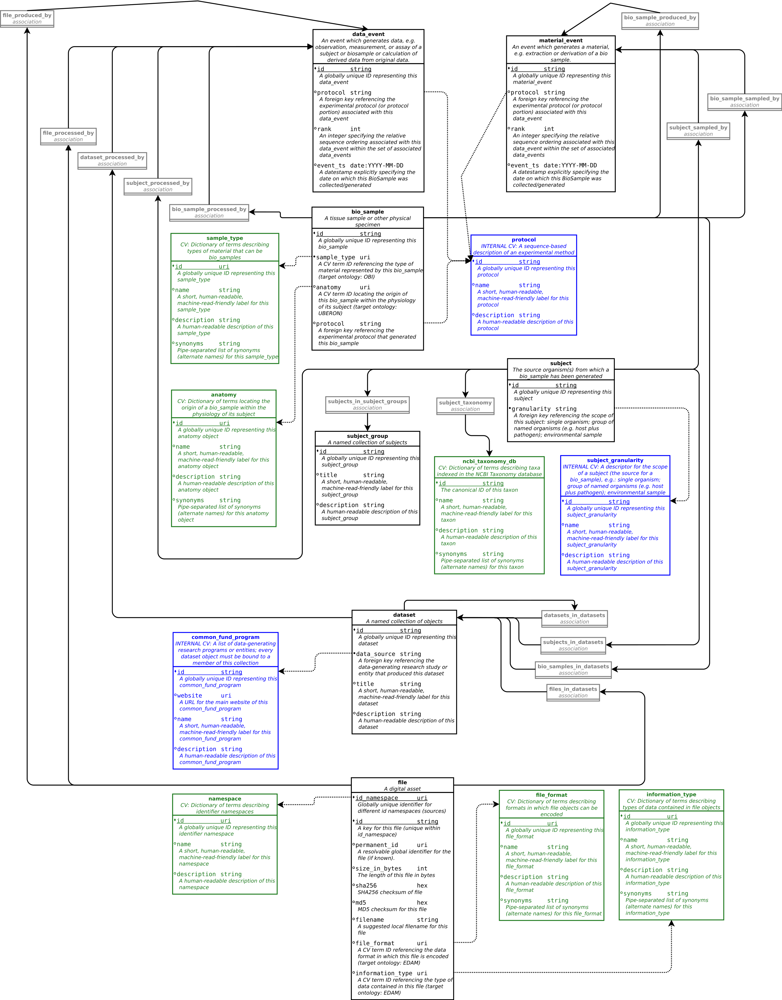

# The Common Fund Data Ecosystem's Crosscut Metadata Model (CFDE C2M2)

This document introduces the Crosscut Metadata Model (C2M2),
a flexible standard for describing biomedical experimental
data. The Common Fund Data Ecosystem group is creating a new
infrastructure, with C2M2 as its central concept, through
which powerful cross-dataset searches, custom aggregation
of experimental data and scale-powered statistical analysis
methods will be made possible for the biomedical research
community at an unprecedented scope.

Using this new infrastructure, data coordinating centers
([DCCs](../draft-CFDE_glossary/glossary.md#DCCs)) can
share structured information ([metadata](../draft-CFDE_glossary/glossary.md#metadata))
about their experimental resources with the research
community, widening and deepening access to usable
observational data and accelerating discovery.

## DCC Metadata Submissions

DCCs will collect and provide metadata to CFDE describing
experimental resources within their purview. Each metadata
submission will take the form of a collection of tab-separated value
files (TSVs): precise formatting requirements for these TSV
collections will be specified by JSON Schema documents
implementing the [Data Package](http://frictionlessdata.io/docs/data-package/)
meta-specification published by the [Frictionless Data](http://frictionlessdata.io/)
group. These schemas will be used by the CFDE software
infrastructure to automatically validate submission format compliance
and metadata integrity during the [ingestion process](../draft-CFDE_glossary/glossary.md#DCC-data-ingestion-process).

CFDE will offer DCCs multiple alternatives for metadata submission
formats, all of which will be automatically interoperable with the
C2M2 ecosystem. These alternative formats are arranged in
levels tiered according to increasing complexity, reflecting
anticipated differences in the relative richness of metadata
available to different DCCs at any particular time. The general
expectation will be that the metadata submitted and managed by a
DCC will be able to transition, over time, through
increasingly rich modeling levels -- enabling increasingly powerful downstream
applications -- as the life cycle of DCC/CFDE technical interaction
progresses.

## C2M2 Richness Levels

In its [fullest form](../draft-C2M2_ER_diagrams/Level-2-C2M2-model.png),
C2M2 is an [entity-relationship system](../draft-CFDE_glossary/glossary.md#entity-relationship-model)
that models common properties of resources fundamental
to biomedical research like subjects, digital files,
events, samples, and project datasets. Essential
relationships between these fundamental resources are also formally described,
documenting (for example) the samples that were processed
to produce a particular data file; which subject a given sample was
drawn from (possibly obfuscated to protect patient privacy); or when
a particular blood pressure measurement was made.

Modeling and data wrangling are always difficult, even for
experts. Requiring every DCC to model their metadata using
all possible features of the [full (Level 2) C2M2 model](../draft-C2M2_ER_diagrams/Level-2-C2M2-model.png)
as a precondition for submitting metadata to CFDE would
be infeasible for several important reasons (apart from
creating avoidable and unnecessary onboarding delays).
Perhaps the most operationally relevant of these is that
the C2M2 model must remain as flexible as possible, especially
during its developmental phases, in order to accomodate mutual learning
between DCCs and CFDE as the process of data ingestion
develops. It is far more expensive and error-prone to
repeatedly change a complex model than it is to build
one gradually from a simpler core concept which is allowed
to stabilize before more specialized branches are allowed
to solidify.

With the design of C2M2, we are splitting the difference
between the ease of evolution inherent in a simple model and
the operational power provided to downstream applications by more
complicated and difficult-to-maintain frameworks.
DCCs with advanced, operationalized metadata modeling
systems of their own should not encounter arbitrary
barriers to CFDE support for more extensive relational
modeling of their metadata if they want it; CFDE will
maintain such support by iteratively refining the
[full C2M2 model](../draft-C2M2_ER_diagrams/Level-2-C2M2-model.png)
according to needs identified while working with
more operationally advanced DCCs. Newer or smaller DCCs, by contrast, may
not currently have enough readily-available information
to feasibly describe their experimental resources using this
most complex C2M2 modeling level: CFDE will support
cases like these by offering simpler but still well-structured
metadata models, lowering some of the barriers to rapid
entry into the data ecosystem.

Simpler C2M2 metadata Levels must be maintained by
CFDE in such a way as to maximize interoperability with
more complex C2M2 variants, and the whole system should be
structured to minimize the negative side effects of model
changes. These considerations have led to the
creation of C2M2 [richness levels](../draft-CFDE_glossary/glossary.md#richness-levels):
concentric, canonical variants of C2M2 which are benchmarked at
increasing levels of complexity and detail, wherein each successive
level is a value-added superset of all of the metadata
encompassed by the previous (less complex) level.

Accordingly, CFDE presently offers two less complex C2M2 variants
in addition to the full (Level 2) C2M2 model:
[Level 0](#Level-0) (basic metadata describing a collection of digital files) and
[Level 1](#Level-1) (which introduces models for core experimental
resources like biosamples and subjects, and the core relationships between them; a rudimentary set of search targets
in the form of annotations like the anatomical location of
the source for a human tissue sample or taxonomic data describing
biosample source organisms and study subjects; and basic support for arranging
experimental resources into sub-collections based on a
hierarchy of projects, experimental datasets or other similar subdivisions
of research ownership and responsibility).

_Level 2 currently requires work to (a) expand and finalize a [brainstorm-level checklist of supported concepts](../draft-C2M2_Levels_spreadsheets/Level_definitions.csv) followed by (b) harmonization of that checklist with an ongoing [draft ER model](../draft-C2M2_ER_diagrams/Level-2-C2M2-model.png)._

--------------------------------------------------------------------------------

### Level 0

C2M2 Level 0 defines a **minimal valid C2M2 instance.** Data submissions
at this level of metadata richness will be the easiest to produce, and will
support the simplest available functionality implemented by
downstream applications.

#### Level 0 submission process: overview

Metadata submissions at Level 0 will consist of a single TSV
file describing a **collection of digital
files** owned or managed by a DCC. The properties listed
for the Level 0 `file` entity (see below for
diagram and definitions) will serve as the TSV's column
headers; each TSV row will represent a single file. The
Level 0 TSV itself thus represents a
**[manifest](../draft-CFDE_glossary/glossary.md#CFDE-asset-manifest)
or inventory** of digital files that a DCC wants to
introduce into the C2M2 metadata ecosystem.

This level encodes the most basic file metadata:
its use by downstream applications will be
limited to informing the least specific level of data
accounting, querying and reporting.

|_Level 0 model diagram_|
|:---:|
||

#### Level 0 technical specification: properties of the `file` entity

**Required: `id_namespace` `id` `sha256|md5`**

|property|description|
|:---:|:---|
| `id_namespace` | String **identifier given by CFDE to the DCC managing this `file`**. The value of this property will be used together with `id` (assigned to each `file` by the DCC that owns it) as a **paired-key structure formally identifying Level 0 `file` entities** within the total C2M2 data space.|
| `id` | Unrestricted-format **string identifying this `file`, assigned by the DCC managing it**. Can be any string as long as it **uniquely identifies each `file`** within the scope defined by the accompanying `id_namespace` value. |
| `persistent_id` | **A persistent, resolvable URI generated by a DCC** (using, e.g., the CFDE minid server) **and permanently attached to this `file`**, to serve as a permanent address to which landing pages (which summarize metadata associated with this `file`) and other relevant annotations and functions can eventually be attached, including (optionally) resolution to a network location from which the `file` can be downloaded. **Actual network locations must not be embedded directly within this identifier**: one level of indirection is required in order to allow network addresses to change over time as files are moved around. |
| `size_in_bytes` | The **size of this `file` in bytes**. This varies (even for "copies" of the same `file`) across differences in storage hardware and operating system. CFDE does not require any particular method of byte computation: file size integrity metadata will be provided in the form of checksum data in the `sha256` and/or `md5` properties. `size_in_bytes` will instead underpin automatic reporting of basic storage statistics across different C2M2 collections of DCC metadata.|
| `sha256` | **CFDE-preferred** file checksum string: the output of the SHA-256 cryptographic hash function after being run on this `file`. One or both of `sha256` and `md5` is required. |
| `md5` | **Permitted** file checksum string: the output of the MD5 message-digest algorithm after being run as a cryptographic hash function on this `file`. One or both of `sha256` and `md5` is required. (CFDE recommends SHA-256 if feasible, but we recognize the nontrivial overhead involved in recomputing these hash values for large collections of files, so if MD5 values have already been generated, CFDE will accept them.) |
| `filename` | A filename with no prepended PATH information. |

#### Level 0 metadata submission examples: Data Package JSON Schema and example TSVs

A JSON Schema document -- implementing [Frictionless
Data](https://frictionlessdata.io/)'s "[Data
Package](https://frictionlessdata.io/data-package/)" container meta-specification --
defining the Level 0 TSV is
[here](../draft-C2M2_JSON_Schema_datapackage_specs/C2M2_Level_0.datapackage.json);
an example Level-0-compliant TSV submission collection can be found
[here](../draft-C2M2_example_submission_data/HMP__sample_C2M2_Level_0_bdbag.contents/file.tsv)
(just the `file.tsv` portion) and
[here](../draft-C2M2_example_submission_data/HMP__sample_C2M2_Level_0_bdbag.tgz)
(as a packaged BDBag archive).

--------------------------------------------------------------------------------

### Level 1

C2M2 Level 1 models **basic experimental resources and associations between them**.
This level of metadata richness is more difficult to produce than Level 0's flat
inventory of digital files. As a result, Level 1 metadata offers users more powerful
downstream tools than are available for Level 0 datasets, including
   * faceted searches on a (small) set of biologically relevant features (like anatomy
   and taxonomy) of experimental resources like `biosample`s and `subject`s
   * organization of summary displays using subdivisions of experimental metadata
   collections by `project` (grant or contract) and `collection` (any scientifically
   relevant grouping of resources)
   * basic reporting on changes in metadata over time, tracking (for example)
   creation times for `file`s and `biosample`s

C2M2 Level 1 is designed to offer an intermediate tier of difficulty, in terms of
preparing compliant submissions, between Level 0's basic digital inventory
and the full intricacy of Level 2 C2M2 (the most powerful and flexible research-asset
metadata model that can be meaningfully generalized to represent multiple CFDE datasets).
Accordingly, we have reserved several modeling concepts -- requiring the most effort
to produce and maintain -- for Level 2. The following are **not modeled at Level 1**:
   * any and all **protected data**
   * documentation of  **experimental protocols**
   * event-based resource generation/**provenance networks**
   * detailed information on **organizations and people** governing the research
   being documented
   * a **comprehensive suite** of options to model **scientific attributes of
   experimental resources**
      * full collection of features like anatomy, taxonomy, and assay type,
      plus formal vocabularies to describe them
      * prerequisite to offering research users deep and detailed search possibilities

#### Level 1 submission process: overview

_Build the black (core entity) and blue (containment relationship) tables
shown in the diagram below. We'll give you copies of the gold tables to include
with your submission: you'll reference IDs from these tables in the (blue and black) tables
you're building directly. Once you've built the core entity and containment tables,
the green tables can be built automatically using our term-scanner script, which will
collect all relevant CV terms used throughout your tables and will create the
corresponding green tables, using data loaded from versioned, whole-CV reference
documents (like OBO files)._

_Color key:_

* _Gold: CFDE-internal controlled vocabularies/dictionaries and their foreign-key relationships_
   * _Note: for representational clarity, gold FK arrows are implied (but not drawn)
from all_ `id_namespace` _fields to the header block of the_ `id_namespace` _table._
* _Green: external CVs (term & display-decoration tracking tables) and their foreign-key relationships_
* _Blue: containers and their containment relationships_
* _Black: core entities and the direct associative relationships between them (plus_
`subject` _<->_ `subject_role_taxonomy` _)_

|_Level 1 model diagram_|
|:---:|
||

#### Level 1 technical specification

##### Core entities

   * `file` _revisited (additions: also cf. below, §"Common fields" and §"Controlled
   vocabularies and term tables")_
   * `biosample` _introduced (also cf. below, §"Common fields" and §"Controlled vocabularies and
   term tables")_
      * _Level 1 models_ `biosample` _s as abstract materials that are directly consumed
      by one or more analytic processes. Simple provenance relationships -- between each
      such_ `biosample` _and the_ `subject` _from which it was originally derived, as well
      as between each_ `biosample` _and any_ `file` _s analytically derived from it -- are
      represented using association tables, with one such table dedicated to each
      relationship type (cf. below, §"Association tables and inter-entity relationships").
      Actual DCC-managed provenance metadata will sometimes (maybe always) represent more complex and
      detailed provenance networks: in such situations, chains of "_`this` _produced_
      `that`_" relationships too complex to model at Level 1 will need to be
      transitively collapsed. As an example: let's say a research team collects a
      cheek-swab sample from a hospital patient; subjects that swab sample to several
      successive preparatory treatments like centrifugation, chemical ribosomal-RNA
      depletion and targeted amplification; then runs the final fully-processed
      remnant material through a sequencing machine, generating a FASTQ sequence
      file as the output of the sequencing process. In physical terms our team
      will have created a series of distinct material samples, connected one to another
      by (directed) "_`X` `derived_from` `Y`_" relationships, represented as a (possibly
      branching) graph path (in fully general terms, a directed acyclic graph) running
      from a starting node set (here, our original cheek-swab sample) through intermediate
   	nodes (one for each coherent material product of each individual preparatory process)
   	to some terminal node set (in our case, the final-stage, immediately-pre-sequencer
   	library preparation material). C2M2 Level 2 offers metadata structures to model
   	this entire process in full detail, including representational support for all
   	intermediate_ `biosample` _s, and for the various preparatory processes involved.
   	For the purposes envisioned to be served by Level 1 C2M2 metadata, on the other hand,
   	only_ `subject` _<->_ `some_monolothic_stuff` _<->_ `(FASTQ) file` _can and should be
   	explicitly represented._
         * _The simplifications here are partially necessitated by the fact that
   	   event modeling has been deliberately deferred to C2M2 Level 2, so all the
   	   relationships represented here as "<->" are undirected, and so the notion of a
   	   "chain of provenance" cannot be fairly represented by this model._
         * _In addition to the event modeling just mentioned, experimental process modeling
         has also been assigned to Level 2._
         * _With both of these (more complex) aspects of experimental metadata
         masked at C2M2 Level 1, the most appropriate granularity at which a Level 1_
         `biosample` _entity should be modeled is as an abstract "material phase"
         (possibly masking what is in reality a chain of multiple distinct materials)
         that enables an analytic (or observational or other scientific) process, which
         originates in a_ `subject` _, to move forward and ultimately produce one or
         more_ `file` _s._  
      * _In practice, a Level 1 C2M2 instance builder facing such a situation
   	might reasonably create one record for the originating_ `subject` _; create one_
   	`biosample` _entity record; create a_ `file` _record for the FASTQ file produced
   	by the sequencing process; and hook up_ `subject` _<->_ `biosample` _and_
   	`biosample` _<->_ `file` _relationships via the corresponding association tables
   	(cf. below, §"Association tables and inter-entity relationships").
         * _In terms of deciding (in a well-defined way) specifically which native DCC
         metadata should be attached to this Level 1_ `biosample` _record, one
         might for example choose to import metadata (IDs, etc.) describing the
         final pre-sequencer material. The creation of specific rules governing maps
         from native DCC data to (simplified, abstracted) Level 1 entity records
         is of necessity left up to the best judgment of the serialization staff
         creating each DCC's Level 1 C2M2 ETL instance; we recommend consistency,
         but beyond that, custom solutions will have to be developed to handle
         different data sources. CFDE staff will be available to help navigate any
         complexity encountered when establishing a map between the native details
         of DCC sample metadata and the approximation that is the C2M2 Level
         1_ `biosample` _entity._
         * _Note in particular that this example doesn't preclude attaching multiple_
         `biosample` _s to a single originating_ `subject` _; nor does it preclude modeling a
         single_ `biosample` _that produces multiple_ `file` _s._
         * _Note also that the actual end-stage material prior to the production of a_
         `file` _might not always prove to be the most appropriate metadata source from
         which to populate a corresponding_ `biosample` _entity. Let's say a
         pre-sequencing library prepration material_ `M` _is divided in two to
         produce derivative materials_ `M1` _and_ `M2` _, with_ `M1` _and_ `M2` _then
         amplified separately and sequenced under separate conditions producing_
         `file` _s_ `M1.fastq` _and_ `M2.fastq` _. In such a case -- depending on
         experimental context -- the final separation and amplification processes
         producing_ `M1` _and_ `M2` _might reasonably be ignored for the purposes
         of Level 1 modeling, instead attaching a single (slightly upstream)_
         `biosample` _entity -- based on metadata describing_ `M` _-- to both_ `M1.fastq`
         _and_ `M2.fastq`_. As above, final decisions regarding detailed rules
         mapping native DCC data to Level 1 entities are necessarily left to
         serialization engineers; CFDE staff will be available as needed to offer
         feedback and guidance when navigating mapping issues._
   * `subject` _introduced (also cf. below, §"Common fields" and §"Taxonomy and the `subject` entity")_
      * _The Level 1_ `subject` _entity is a generic container meant to represent any biological
      entity from which a Level 1_ `biosample` _can be generated (the notion of_ `biosample`
      _s being generated by other_ `biosample` _s is more appropriately modeled at C2M2
      Level 2: cf. §"_ `biosample` _", immediately preceding)_
      * _In addition to shared metadata fields (cf. below, §"Common fields") and inter-entity
      associations (cf. below, §"Association tables and inter-entity relationships"), C2M2
      Level 1 models two details specific to_ `subject` _entities:_
         * _internal structural configuration (defined in the_ `subject_granularity` _table
         and specified for each_ `subject` _record via a foreign key field in the_ `subject` _table),
         e.g.: "single organism," "microbiome," "cell line"_
         * _taxonomic assignments attached to subcomponents ("roles," defined in the_
         `subject_role` _table) of_ `subject` _entities, e.g. "cell line ancestor ->
         NCBI:txid9606" or "host (of host-pathogen symbiont system) -> NCBI:txid10090":
         this is accomplished via the_ `subject_role_taxonomy` _trinary association table_
      * _all other_ `subject` _-specific metadata -- including any protected data -- is deferred by
      design to Level 2_

##### Common entity fields

The following properties all have the same meaning and function across
the various entities they describe (`file`, `biosample`, `project`, etc.).

|property|description|
|:---:|:---|
| `id_namespace` | String **identifier given by CFDE to the DCC managing this entity**. The value of this property will be used together with `id` (assigned to each entity by the DCC that owns it) as a **paired-key structure formally identifying Level 1 entities** within the total C2M2 data space.|
| `id` | Unrestricted-format **string identifying this entity, assigned by the DCC managing it**. Can be any string as long as it **uniquely identifies each entity** within the scope defined by the accompanying `id_namespace` value. |
| `persistent_id` | **A persistent, resolvable URI generated by a DCC and permanently attached to this entity**, to serve as a permanent address to which landing pages (which summarize metadata associated with this entity) and other relevant annotations and functions can eventually be attached, including (optionally) resolution to a network location from which the entity can be viewed, downloaded, or otherwise directly investigated. **Actual network locations must not be embedded directly within this identifier**: one level of indirection is required in order to allow network addresses to change over time as entity data is moved around. |
| `creation_time` | An ISO 8601 / RFC 3339 (subset)-compliant timestamp documenting this entity's creation time (or, in the case of a `subject` entity, the time at which the `subject` was first documented by the `project` under which the `subject` was first observed): **`YYYY-MM-DDTHH:MM:SS±NN:NN`**, where <ul><li>**`YYYY`** is a four-digit Gregorian **year**</li><li>**`MM`** is a zero-padded, one-based, two-digit **month** between `01` and `12`, inclusive</li><li>**`DD`** is a zero-padded, one-based, two-digit **day** of the month between `01` and `31`, inclusive</li><li>**`HH`** is a zero-padded, zero-based, two-digit **hour** label between `00` and `23`, inclusive (12-hour time encoding is specifically prohibited)</li><li>**`MM`** and **`SS`** represent zero-padded, zero-based integers between `00` and `59`, inclusive, denoting Babylonian-sexagesimal **minutes** and **seconds**, respectively</li><li>**`±`** denotes exactly one of `+` or `-`, indicating the direction of the offset from GMT (Zulu) to the local time zone (or `-` in the special case encoded as `-00:00`, in which the local time zone is unknown or not asserted)</li><li>**`NN:NN`** represents the **hours:minutes** differential between GMT/Zulu and the local time zone context of this `creation_time` (qualified by the preceding `+` or `-` to indicate offset direction), with `-00:00` encoding the special case in which time zone is unknown or not asserted (`+00:00`, by contrast, denotes the GMT/UTC/Zulu time zone itself)</li></ul> Except for the **time zone** segment of `creation_time` (**`±NN:NN`**, just described) and the **year** (**`YYYY`**) segment, all other constituent segments of `creation_time` named here may be zeroed (rendered as `00`) to indicate a lack of available data at the corresponding precision. We are aware (and unconcerned) that this technically renders the value `00:00:00` ambiguous. |
| `abbreviation`, `name` and `description` | _Values for contextual display in portal and dashboard interfaces: severely restricted_ `abbreviation` _; terse but flexible_ `name` _; abstract-length_ `description` |

##### Containers

   * `project`
      * _explain "primary project" FK in_ `file`/`biosample`/`subject`
   * `collection`
      * _note partial decoupling from_ `project`

##### Controlled vocabularies and term tables

   * _enumerate CVs_
   * _describe term tables_
   * _outline plan for addressing versioning_
   * _discuss parser script on offer_
      * _to be executed during bdbag-preparation stage_
      * _will inflate bare CV terms cited in entity fields into corresponding CV
      term-usage tables_
      * _auto-loads and populates display-layer term-decorator data (name,
      description) from relevant CV OBO reference files_

##### Taxonomy and the `subject` entity

   * `subject_granularity`: `subject` _multiplicity specifier_
   * `subject_role`: _constituent relationship to intra-_`subject` _system_
   * `ncbi_taxonomy`: _examples of how to map taxa to_ `subject` _constituents via_ `subject_role_taxonomy`

##### Association tables and inter-entity relationships

   * _enumerate relationship/association definitions_
   * _explicit guidance regarding empty (header-only) TSVs_
   * _note potential ingest-stage flattening for rapid service of roll-up queries for
   display layer_

#### Level 1 metadata submission examples: Data Package JSON Schema and example TSVs

A JSON Schema document -- implementing
[Frictionless Data](https://frictionlessdata.io/)'s
"[Data Package](https://frictionlessdata.io/data-package/)"
container meta-specification -- defining the Level 1 TSV collection is
[here](../draft-C2M2_JSON_Schema_datapackage_specs/C2M2_Level_1.datapackage.json);
an example Level-1-compliant TSV submission collection can be found
[here](../draft-C2M2_example_submission_data/HMP__sample_C2M2_Level_1_bdbag.contents/)
(as a bare collection of TSV files) and
[here](../draft-C2M2_example_submission_data/HMP__sample_C2M2_Level_1_bdbag.tgz)
(as a packaged BDBag archive).

--------------------------------------------------------------------------------

### Level 2 (the full C2M2 model)

1. _**New modeling concept checklist:**_
	* clinical **visit data**
	* modular **experimental flow (`protocol`)**
	   * relatively _passive documentation_ of standard protocols and custom procedures
	   * rigorous and detailed stepwise modeling is _not_ anticipated
	* resource (entity) **provenance (`[data|material]_event` network)**
	* structured addressbook for documenting and linking **organizations
	(`common_fund_program`) and people** to C2M2 metadata
	* any C2M2 handling of **protected data**
	* full elaboration of scientific attributes of C2M2 entities using
	**controlled-vocabulary metadata decorations**
	   * i.e., substrate data for facet-search targets
	   * e.g., Level 1's `anatomy`, `assay_type`, `ncbi_taxonomy`, etc.)
	   * [enumerate requirements and scope for more complex modeling of scientific
	   metadata_]
2. _might need a **better name** than 'full C2M2' or 'Level 2'_
3. _**diagram & JSON Schema need updating** to harmonize with drafts for Levels 0 and 1_

|_The full C2M2 model_|
|:---:|
||

#### ...

#### Level 2 submissions: schema and example TSVs

The JSON Schema document specifying the full Level 2 C2M2 TSV
collection is [here](../draft-C2M2_JSON_Schema_datapackage_specs/full_C2M2_datapackage_spec.json);
example Level-2-compliant TSV submissions will be found **here**.
